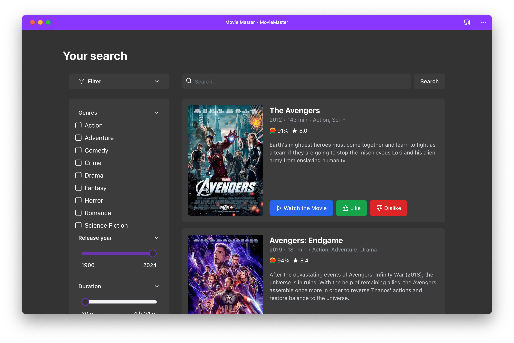
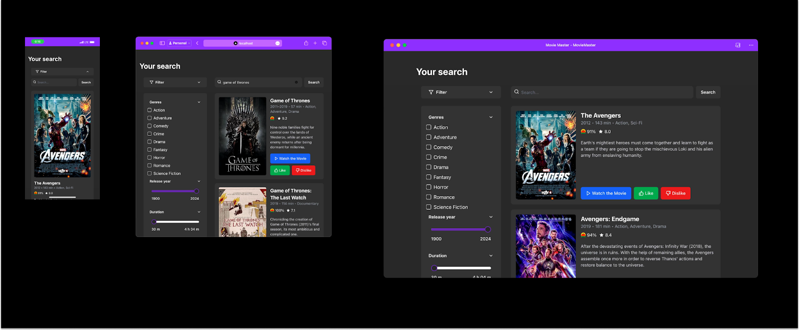
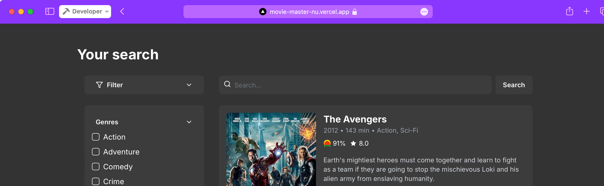
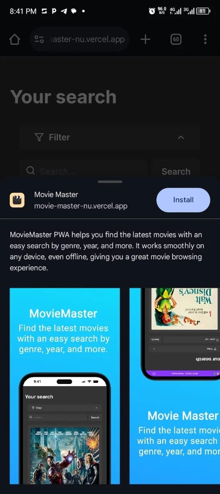
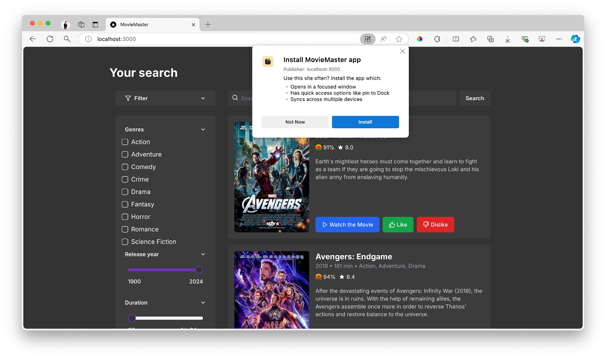
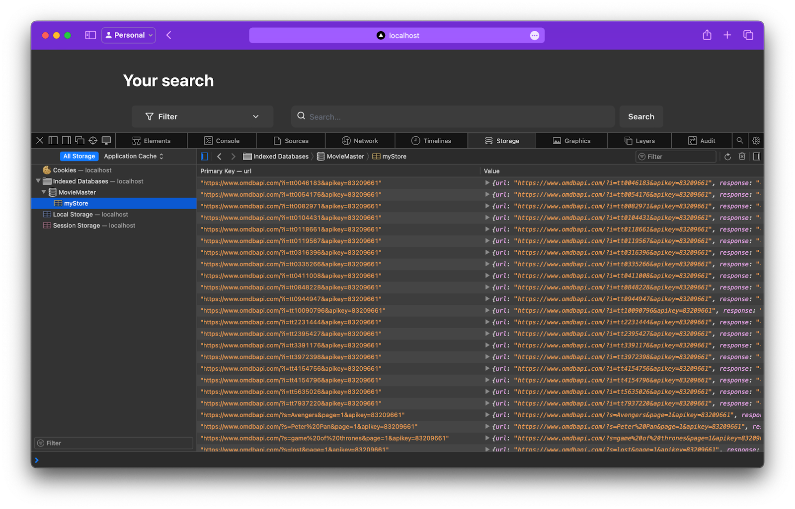
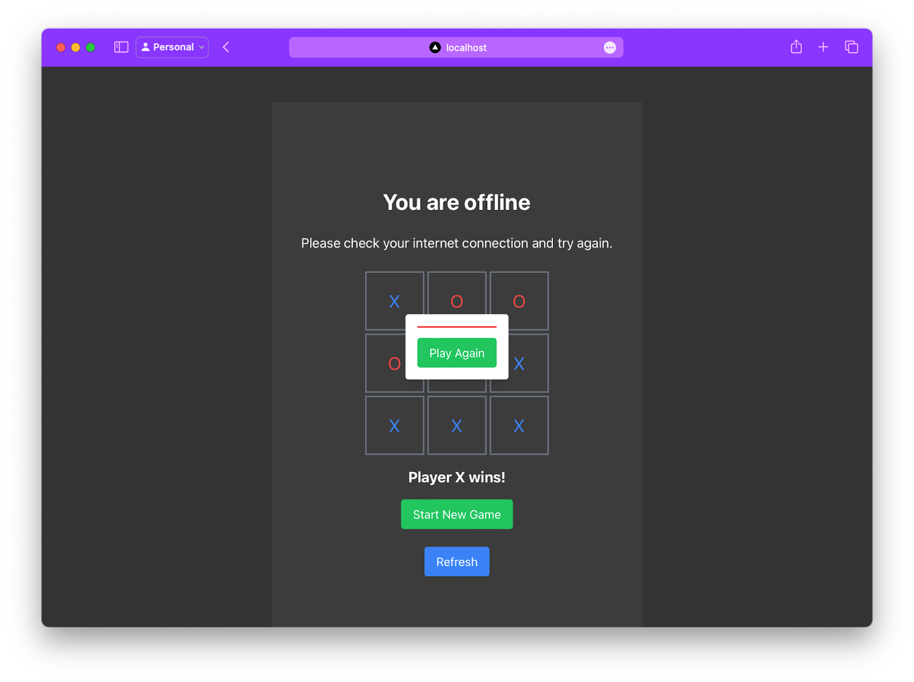

# Как создать прогрессивное веб-приложение (PWA) с помощью Next.js



<big>
Хотели ли вы когда-нибудь создать веб-приложение, которое бы плавно работало на любом устройстве - в Интернете, на мобильном или настольном компьютере? Представьте, что ваше приложение могло бы быстро загружаться, работать без подключения к Интернету и ощущаться как родное, при этом его не нужно было бы устанавливать из магазина приложений. Именно это и могут сделать **прогрессивные веб-приложения** (PWA).
</big>

В этом уроке вы узнаете, как создать PWA с помощью Next.js. Мы начнем с создания функционального сайта для поиска фильмов с помощью этих инструментов. После того как мы создадим базовую версию, мы превратим это приложение в PWA, добавив поддержку офлайн и ускорив время загрузки. В итоге у вас будет мощный PWA, обеспечивающий удобство работы на всех платформах - и все это на основе единой кодовой базы.

**Что мы рассмотрим**

-   **Установка проекта**: Мы начнем с создания приложения для поиска фильмов с помощью Next.js, который в 2024 году является идеальным выбором для создания быстрых, надежных приложений React, которые хорошо работают на всех устройствах.
-   **Превращение приложения в PWA**: Далее мы рассмотрим шаги по преобразованию приложения в Progressive Web App, охватывающие ключевые особенности и лучшие практики PWA.
-   **Добавление поддержки офлайн**: Наконец, мы обеспечим работоспособность вашего приложения даже при отсутствии подключения к Интернету, реализовав возможность работы в автономном режиме.

Вот как будет выглядеть готовое приложение:


**Аудитория**

Это руководство предназначено для разработчиков React любого уровня, как начинающих, так и уже опытных. Если вы хотите усовершенствовать свои веб-приложения с помощью функций PWA, это руководство проведет вас через все необходимые шаги.

**Предварительные условия**

Прежде чем начать, убедитесь, что вы знакомы с React.js и Next.js. Если вы новичок в PWA, вам стоит прочитать несколько вводных статей, чтобы получить краткое представление.

-   [Что такое прогрессивные веб-приложения? Руководство по PWA для начинающих](https://www.freecodecamp.org/news/what-are-progressive-web-apps-pwa-guide/)
-   [Изучите прогрессивные веб-приложения](../../learn/pwa/index.md)

## Что такое прогрессивное веб-приложение (PWA)?

Прогрессивное веб-приложение (PWA) - это тип веб-приложения, построенного с использованием стандартных веб-технологий, таких как HTML, CSS и JavaScript. PWA работают в Интернете, на настольных компьютерах и мобильных устройствах, сочетая в себе лучшие черты веб-приложений и нативных приложений для обеспечения быстрой, надежной и увлекательной работы.

Особенностью PWA является их способность работать в автономном режиме, отправлять push-уведомления и устанавливаться на устройство пользователя без магазина приложений. Одним словом, PWA позволяет вашему веб-приложению чувствовать себя как родное приложение, сохраняя при этом гибкость и широкий охват веб-ресурсов.

### Зачем превращать веб-приложение в PWA?

Преобразование вашего веб-приложения в PWA дает несколько преимуществ:

-   **Кросс-платформенная доступность**: PWA работает на любом устройстве с браузером, поэтому вам нужно разрабатывать и поддерживать только одну кодовую базу для веб-приложений, мобильных и настольных приложений. Это экономит время и обеспечивает согласованную работу на всех платформах.

    

-   **Офлайн-возможности**: PWA могут работать в автономном режиме или в местах с плохим соединением, кэшируя необходимые ресурсы, что позволяет поддерживать работоспособность приложения даже при отсутствии доступа к интернету.

-   **Повышенная производительность**: PWA быстро загружаются и работают без сбоев даже в медленных сетях благодаря таким технологиям, как Service worker и кэширование.

-   **Увеличение вовлеченности пользователей**: Пользователи могут добавлять PWA прямо на домашний экран, не обращаясь к магазину приложений. Этот легкий доступ, а также такие функции, как push-уведомления, помогают пользователям оставаться на связи и возвращаться.

**Недостатки PWA**

Хотя PWA обладают множеством преимуществ, есть и несколько недостатков:

-   **Ограниченный доступ к функциям устройства**: PWA не имеют полного доступа к некоторым функциям устройства, таким как Bluetooth или расширенное управление камерой. Для приложений, которым требуется глубокая интеграция с оборудованием, это может стать ограничением.

-   **Меньшая видимость**: Поскольку PWA не продаются через магазины приложений, они лишены видимости, которую предлагают магазины приложений. Кроме того, некоторые пользователи предпочитают загружать приложения из магазинов приложений, а не напрямую из браузера.

-   **Ограниченная поддержка iOS**: Некоторые функции PWA, например push-уведомления, не так хорошо работают на iPhone и iPad по сравнению с устройствами Android, что может ограничить вовлеченность пользователей iOS.

## Начало работы: Настройка проекта Next.js

Теперь, когда мы рассказали о преимуществах PWA, давайте перейдем к их практической реализации. Начнем с настройки необходимых файлов в нашем проекте.

### Почему стоит выбрать Next.js в 2024 году?

Next.js - лучший выбор для создания React-приложений в 2024 году. Он предлагает такие функции, как рендеринг на стороне сервера и генерация статических сайтов, что упрощает создание быстрых и надежных веб-приложений. Благодаря этим функциям ваше приложение будет хорошо работать на всех устройствах и даже в автономном режиме.

### Установка проекта

Выполните следующие шаги, чтобы установить проект Next.js:

1.  Клонируйте репозиторий: Откройте терминал и выполните команду:

    ```sh
    git clone https://github.com/iamspruce/MovieMaster.git
    ```

2.  Перейдите в каталог вашего проекта:

    ```sh
    cd your-repo
    ```

3.  Установите зависимости: Установите необходимые пакеты с:

    ```sh
    npm install
    ```

Настройте переменные окружения: Создайте файл `.env.local` в корневом каталоге и добавьте в него свой ключ OMDB API:

```env
NEXT_PUBLIC_OMDB_API_KEY=your-api-key
```

Вы можете получить свой ключ API на сайте [OMDB API](https://www.omdbapi.com/apikey.aspx).

**Зачем нужен ключ API OMDB?**

API-ключ OMDB позволяет вашему PWA получать данные о фильмах, такие как названия, постеры и описания, непосредственно из базы данных OMDB. Это очень важно для приложений, связанных с фильмами, таких как MovieMaster, поскольку они предоставляют пользователям актуальную информацию без необходимости хранить все данные самостоятельно.

В PWA использование такого API, как OMDB, гарантирует, что приложение сможет предоставлять пользователям свежий контент, даже когда оно установлено на их устройствах. В сочетании с функциями кэширования и автономной работы PWA пользователи смогут просматривать информацию о фильмах, которая была получена ранее, даже если они потеряют связь с Интернетом.

!!!note ""

    Убедитесь, что в вашей системе установлены Node.js и npm. Если они не установлены, вы можете загрузить их с сайта [nodejs.org](https://nodejs.org/).

#### Обзор структуры проекта

Вот краткий обзор структуры проекта:

-   `/public`: Содержит статические файлы, такие как изображения и favicons.
-   `/src/app`: Содержит основные файлы приложения, включая глобальные стили (`globals.css`), главную страницу (`page.tsx`), конфигурации макета (`layout.tsx`) и логику клиентской стороны (`RootLayoutClient.tsx`).
-   `/src/components`: Включает в себя компоненты многократного использования. Компоненты пользовательского интерфейса Shadcn находятся в директории `/ui`, а другие специфические компоненты, такие как `MovieCard.tsx`, находятся здесь.
-   `/src/lib`: Содержит служебные функции и код для получения данных, такие как `fetchMovies.ts` и `useMediaQuery.ts`.

Для стилизации мы используем:

-   **TailwindCSS**: Применяется через `globals.css`, что обеспечивает подход к дизайну с точки зрения полезности.
-   **Shadcn UI**: Библиотека, предоставляющая доступные, готовые к использованию компоненты пользовательского интерфейса.

#### Понимание макетов

В проекте используются два ключевых макета:

1.  `layout.tsx`: Управляет рендерингом на стороне сервера и устанавливает метаданные приложения. Он использует компонент `RootLayoutClient` для работы с функциями на стороне клиента. Вот как это выглядит:

    ```tsx
    import React from 'react';
    import type { Metadata } from 'next';
    import { cn } from '@/lib/utils';
    import { Inter as FontSans } from 'next/font/google';

    import RootLayoutClient from './RootLayoutClient';

    const fontSans = FontSans({
        subsets: ['latin'],
        variable: '--font-sans',
    });

    export const metadata: Metadata = {
        title: 'MovieMaster',
        description: `MovieMaster PWA helps you find the latest movies
    		 with an easy search by genre, year, and more. It works
    		 smoothly on any device, even offline, giving you a great
    		 movie browsing experience.`,
        manifest: '/web.manifest',
    };

    export default function RootLayout({
        children,
    }: {
        children: React.ReactNode;
    }) {
        return (
            <html lang="en" suppressHydrationWarning>
                <body
                    className={cn(
                        'min-h-screen bg-background font-sans antialiased',
                        fontSans.variable,
                    )}
                >
                    <RootLayoutClient>
                        {children}
                    </RootLayoutClient>
                </body>
            </html>
        );
    }
    ```

2.  `RootLayoutClient.tsx`: Обрабатывает логику на стороне клиента, необходимую для рендеринга интерактивных элементов и управления состояниями пользовательского интерфейса.

    ```tsx
    'use client';

    import React from 'react';
    import { Toaster } from '@/components/ui/sonner';
    import './globals.css';

    export default function RootLayoutClient({
        children,
    }: {
        children: React.ReactNode;
    }) {
        return (
            <div className="text-white flex flex-col">
                <div className="container mx-auto px-4 max-w-[1024px]">
                    {children}
                    <Toaster />
                </div>
            </div>
        );
    }
    ```

#### Запуск и предварительный просмотр проекта

Чтобы начать работу с проектом, выполните следующие действия:

**Запустите сервер разработки**: В терминале выполните:

```sh
npm run dev
```

Это запустит сервер разработки, и вы сможете просмотреть приложение, перейдя по адресу <http://localhost:3000> в браузере.

## Как превратить ваше веб-приложение в PWA

Чтобы превратить ваше веб-приложение в PWA, существуют определенные критерии, которым должно соответствовать ваше приложение. Давайте пройдемся по этим требованиям и пошагово внесем необходимые изменения.

### Критерии для PWA

1.  **Обслуживание по HTTPS**: Ваше приложение должно обслуживаться через защищенный источник (HTTPS) или `localhost` для разработки. Если вы разрабатываете локально, то этот критерий уже выполнен.
2.  **Файл веб-манифеста**: Файл веб-манифеста содержит метаданные о вашем приложении, такие как его название, иконки и стартовый URL. Этот файл очень важен для того, чтобы ваше приложение можно было установить на устройство пользователя.
3.  **Service worker с событием `fetch`**: Ваше приложение должно зарегистрировать Service worker с событием `fetch`. Регистрация Service worker с событием `fetch` необходима для того, чтобы ваше приложение было распознано как PWA и могло быть установлено. Кроме того, Service worker повышают производительность и надежность вашего приложения, позволяя ему кэшировать ресурсы и обрабатывать сетевые запросы даже в автономном режиме.

### Как добавить файл веб-манифеста в ваше приложение Next.js

Чтобы добавить файл веб-манифеста в приложение Next.js, поместите его в каталог `public/` и сделайте ссылку на него в файле макета. Убедитесь, что все изображения, которые вы включили в файл манифеста, также находятся в директории `public/`.

Вот пример файла `web.manifest`:

```json
{
    "name": "Movie Master",
    "short_name": "Moviemaster",
    "theme_color": "#8936FF",
    "background_color": "#333333",
    "start_url": "/",
    "id": "MovieMaster",
    "display": "standalone",
    "description": "MovieMaster PWA helps ... browsing experience.",
    "icons": [
        {
            "purpose": "maskable",
            "sizes": "512x512",
            "src": "icon512_maskable.png",
            "type": "image/png"
        },
        {
            "purpose": "any",
            "sizes": "512x512",
            "src": "icon512_rounded.png",
            "type": "image/png"
        }
    ],
    "screenshots": [
        {
            "src": "screenshot1.png",
            "type": "image/png",
            "sizes": "1080x1920",
            "form_factor": "narrow"
        }
    ]
}
```

#### Обязательные поля

-   `name`: Полное имя вашего приложения.
-   `short_name`: Сокращенная версия названия приложения, отображаемая, когда не хватает места для полного названия.
-   `icons`: Иконки, представляющие ваше приложение в разных размерах.
-   `start_url`: URL-адрес, который открывается при запуске приложения.
-   `display`: Определяет режим отображения (например, `standalone` для полноэкранного режима).

#### Рекомендуемые поля

-   `theme_color`: Устанавливает цвет темы пользовательского интерфейса браузера, например адресной строки. Этот цвет улучшает восприятие вашего PWA.

    В этом примере показано, как цвет темы (`#8936FF`) применяется к пользовательскому интерфейсу браузера, придавая вашему PWA ощущение родного.

    

-   `background_color`: Определяет цвет фона для заставки при запуске вашего приложения.

-   `screenshots`: Предоставьте скриншоты вашего приложения, чтобы улучшить опыт установки, особенно на устройствах Android.

    В этом примере показано, как скриншоты отображаются в процессе установки, что повышает удобство работы с приложением, особенно на устройствах Android.

    

-   `id`: Уникальный идентификатор приложения.

### Как ссылаться на файл веб-манифеста

Далее давайте добавим файл манифеста на ваши страницы. В Next.js вы можете включить его в метаданные вашего `Layout.tsx`:

```tsx
export const metadata: Metadata = {
    title: 'MovieMaster',
    description: 'Find the latest movies with ease.',
    manifest: '/web.manifest', // Link to the manifest file
};
```

### Как зарегистрировать Service worker

Service worker - это скрипт, который браузер запускает в фоновом режиме, позволяя вам управлять тем, как ваше приложение обрабатывает сетевые запросы, кэширование и другие задачи.

Регистрация Service worker с событием `fetch` необходима для того, чтобы ваше приложение было распознано как PWA и могло быть установлено.

Создайте файл `service-worker.js` в директории `public/` со следующим кодом:

```js
self.addEventListener('install', (event) => {
    console.log('Service Worker installing.');
});

self.addEventListener('activate', (event) => {
    console.log('Service Worker activating.');
});

self.addEventListener('fetch', (event) => {
    console.log('Fetching:', event.request.url);
    event.respondWith(fetch(event.request));
});
```

Затем зарегистрируйте Service worker в файле `RootLayoutClient.tsx`:

```tsx
'use client';

import React from 'react';

export default function RootLayoutClient({ children }) {
    React.useEffect(() => {
        if ('serviceWorker' in navigator) {
            navigator.serviceWorker
                .register('/service-worker.js')
                .then((registration) => {
                    console.log(
                        'Service Worker registered with scope:',
                        registration.scope,
                    );
                })
                .catch((error) => {
                    console.error(
                        'Service Worker registration failed:',
                        error,
                    );
                });
        }
    }, []);

    return (
        <div className="text-white flex flex-col">
            <div className="container mx-auto px-4 max-w-[1024px]">
                {children}
            </div>
        </div>
    );
}
```

Когда ваше приложение будет соответствовать всем критериям, пользователи смогут легко установить его на свои устройства. Например, при использовании браузера Edge в меню браузера появится опция установки, которая позволит пользователям добавить ваше приложение прямо на рабочий стол или домашний экран.

Вот как выглядит процесс установки:



## Как добавить поддержку офлайн

На данном этапе, несмотря на то, что наше приложение технически является PWA, оно все еще ведет себя как обычное веб-приложение. Всякий раз, когда пользователь запрашивает ресурс, приложение делает запрос в сеть, и если сеть не работает, пользователю открывается страница с ошибкой. Это не идеальный вариант, особенно когда сила PWA заключается в его способности работать в автономном режиме или в условиях плохой сети.

В PWA вы можете перехватывать каждый запрос, сделанный вашим приложением, используя Service worker. Это дает вам возможность гибко решать, как обслуживать контент - из сети или из кэша. Такой контроль позволяет гарантировать, что пользователи смогут получить доступ к приложению даже при отсутствии подключения к Интернету.

### Как доставлять ресурсы из сети

Давайте начнем с того, как ведет себя наше приложение, которое похоже на любое стандартное веб-приложение:

```js
self.addEventListener('fetch', (event) => {
    event.respondWith(fetch(event.request));
});
```

Этот код просто получает ресурсы непосредственно из сети. Если сеть недоступна, запрос не будет выполнен, что приведет к ошибке. Это поведение по умолчанию для стандартного веб-приложения.

### Как реализовать поддержку офлайн

Чтобы обеспечить работу в автономном режиме, нам нужно кэшировать ресурсы нашего приложения, когда пользователь находится в сети, а затем обслуживать эти кэшированные ресурсы, когда пользователь находится в автономном режиме. Для этого мы используем API Cache Storage, который позволяет нам хранить ресурсы локально на устройстве пользователя.

### Что кэшировать?

Решение о том, что кэшировать, зависит от потребностей вашего приложения. Для такого приложения для поиска фильмов, как наше, мы хотим кэшировать основные ресурсы, необходимые для отображения базовой версии приложения:

-   Главная HTML-страница
-   таблицы стилей CSS, необходимые для отображения сайта
-   Изображения, используемые в пользовательском интерфейсе
-   Файлы JavaScript, необходимые для функциональности
-   ответы на API-запросы

!!!note ""

    Хотя кэшировать можно практически все, не забывайте об ограничениях по объему памяти, поскольку все кэшированные элементы хранятся на устройстве пользователя. Используйте хранилище с умом, чтобы не занимать слишком много места.

### Когда кэшировать?

После того как мы знаем, что кэшировать, нужно подумать о том, когда кэшировать. Нужно ли кэшировать все во время установки Service worker, или же следует кэшировать ресурсы по мере их запроса?

Ответ зависит от потребностей приложения, но хорошей практикой является кэширование основных файлов, необходимых для рендеринга базовой версии приложения, во время установки Service worker.

Вот как это можно сделать:

```js
const CACHE_NAME = 'MOVIE_MASTER_V1';

async function cacheCoreAssets() {
    const cache = await caches.open(CACHE_NAME);
    return cache.addAll([
        '/',
        '/imdb-logo.svg',
        '/rotten-tomatoes-logo.svg',
    ]);
}

self.addEventListener('install', (event) => {
    event.waitUntil(cacheCoreAssets());
    self.skipWaiting();
});
```

В этом коде `self.skipWaiting()` гарантирует, что новый Service worker активируется сразу после установки, минуя фазу ожидания.

Также важно удалять старые кэши при активации нового Service worker:

```js
async function clearOldCaches() {
    const cacheNames = await caches.keys();
    return Promise.all(
        cacheNames
            .filter((name) => name !== CACHE_NAME)
            .map((name) => caches.delete(name)),
    );
}

self.addEventListener('activate', (event) => {
    event.waitUntil(clearOldCaches());
    self.clients.claim();
});
```

Метод `self.clients.claim()` гарантирует, что новый Service worker получит контроль над всеми страницами, как только активируется.

### Динамическое кэширование

Динамическое кэширование особенно полезно для приложений на React, подобных нашему, где статические файлы генерируются автоматически. При динамическом кэшировании вам не нужно знать все файлы заранее. Вместо этого он сам управляет процессом кэширования по мере запроса файлов.

```js
async function dynamicCaching(request) {
    const cache = await caches.open(CACHE_NAME);

    try {
        const response = await fetch(request);
        const responseClone = response.clone();
        await cache.put(request, responseClone);
        return response;
    } catch (error) {
        console.error('Dynamic caching failed:', error);
        return caches.match(request);
    }
}
```

При динамическом кэшировании файлы, запрашиваемые приложением, кэшируются по мере их получения, что обеспечивает их доступность для дальнейшего использования в автономном режиме.

### Кэширование API-запросов

Когда дело доходит до кэширования ответов API, вместо того чтобы кэшировать весь ответ, часто лучше кэшировать конкретные данные, возвращаемые API. Для этого мы можем использовать IndexedDB, локальную базу данных, встроенную в браузер.

IndexedDB более мощная, чем API Cache Storage, особенно для хранения и извлечения структурированных данных, таких как JSON. Это делает его отличным выбором для приложений, в которых требуется хранить сложные данные или эффективно обрабатывать большие объемы информации.



#### Как настроить IndexedDB

Сначала создайте функцию для открытия базы данных и создания хранилища объектов:

```js
const DB_NAME = 'MovieMaster';
const DB_VERSION = 1;
const DB_STORE_NAME = 'myStore';

function openDb() {
    return new Promise((resolve, reject) => {
        const request = indexedDB.open(DB_NAME, DB_VERSION);
        request.onsuccess = () => resolve(request.result);
        request.onerror = () => reject(request.error);
        request.onupgradeneeded = (event) => {
            const db = event.target.result;
            db.createObjectStore(DB_STORE_NAME, {
                keyPath: 'url',
            });
        };
    });
}
```

Затем создайте функции для добавления данных в базу данных и получения их из нее:

```js
async function addData(url, jsonData) {
    const db = await openDb();
    const transaction = db.transaction(
        DB_STORE_NAME,
        'readwrite',
    );
    const store = transaction.objectStore(DB_STORE_NAME);

    const data = {
        url,
        response: JSON.stringify(jsonData),
    };

    const request = store.put(data);
    await new Promise((resolve, reject) => {
        request.onsuccess = () => resolve();
        request.onerror = () => reject(request.error);
    });
}

async function getData(url) {
    try {
        const db = await openDb();
        const transaction = db.transaction(
            DB_STORE_NAME,
            'readonly',
        );
        const store =
            transaction.objectStore(DB_STORE_NAME);

        const request = store.get(url);

        const result = await new Promise(
            (resolve, reject) => {
                request.onsuccess = () =>
                    resolve(request.result);
                request.onerror = () =>
                    reject(request.error);
            },
        );

        if (result && result.response) {
            return JSON.parse(result.response);
        }

        return null;
    } catch (error) {
        console.error(
            'Error retrieving from IndexedDB:',
            error,
        );
        return null;
    }
}
```

### Как обслуживать кэшированные ресурсы

После того как мы кэшировали наши активы и сохранили данные API в IndexedDB, следующим шагом будет предоставление этих данных пользователям, когда они находятся в автономном режиме. Существует несколько стратегий для достижения этой цели:

#### Стратегия «сначала кэш»

В стратегии «сначала кэш» мы проверяем, доступен ли ресурс в кэше. Если да, то мы обслуживаем его из кэша, если нет, то получаем его из сети. Это особенно полезно для обслуживания статических активов, таких как HTML, CSS и файлы JavaScript:

```js
async function cacheFirstStrategy(request) {
    try {
        const cache = await caches.open(CACHE_NAME);
        const cachedResponse = await cache.match(request);

        if (cachedResponse) {
            return cachedResponse;
        }

        const networkResponse = await fetch(request);
        const responseClone = networkResponse.clone();
        await cache.put(request, responseClone);
        return networkResponse;
    } catch (error) {
        console.error(
            'Cache first strategy failed:',
            error,
        );
        return caches.match('/offline');
    }
}

self.addEventListener('fetch', (event) => {
    const { request } = event;
    if (event.request.mode === 'navigate') {
        event.respondWith(cacheFirstStrategy(request));
    } else {
        event.respondWith(dynamicCaching(request));
    }
});
```

В этом случае при переходе на новые страницы применяется стратегия «сначала кэш», а динамическое кэширование обрабатывает остальные запросы.

#### Стратегия «сначала сеть»

Стратегия «сначала сеть» является противоположной: она пытается сначала получить ресурсы из сети, а если сеть недоступна, то возвращается к кэшу. Эта стратегия особенно полезна для API-запросов, когда вам нужны самые свежие данные:

```js
async function networkFirstStrategy(request) {
    try {
        const networkResponse = await fetch(request);

        if (networkResponse.ok) {
            const responseClone = networkResponse.clone();
            const responseData = await responseClone.json();
            await addData(request.url, responseData);
            return networkResponse;
        }

        throw new Error('Network response was not ok');
    } catch (error) {
        console.error(
            'Network first strategy failed:',
            error,
        );
        const cachedResponse = await getData(request.url);

        if (cachedResponse) {
            console.log(
                'Using cached response:',
                cachedResponse,
            );
            return new Response(
                JSON.stringify(cachedResponse),
                {
                    status: 200,
                    headers: {
                        'Content-Type': 'application/json',
                    },
                },
            );
        }

        return new Response('[]', { status: 200 });
    }
}

self.addEventListener('fetch', (event) => {
    const { request } = event;
    const url = new URL(request.url);

    if (url.origin === 'https://www.omdbapi.com') {
        event.respondWith(networkFirstStrategy(request));
    } else if (event.request.mode === 'navigate') {
        event.respondWith(cacheFirstStrategy(request));
    } else {
        event.respondWith(dynamicCaching(request));
    }
});
```

В нашем приложении мы используем стратегию network-first для вызовов API, гарантируя, что пользователь получит самые свежие данные в режиме онлайн, а в режиме оффлайн вернется к кэшированным данным в IndexedDB.

#### Полный код Service Worker

Вот полный файл `service-worker.js`, в котором реализовано все, что мы обсудили:

```js
const CACHE_NAME = 'MOVIE_MASTER_V1';
const DB_NAME = 'MovieMaster';
const DB_VERSION = 1;
const DB_STORE_NAME = 'myStore';

async function cacheCoreAssets() {
    const cache = await caches.open(CACHE_NAME);
    return cache.addAll([
        '/',
        '/imdb-logo.svg',
        '/rotten-tomatoes-logo.svg',
        '/offline',
    ]);
}

self.addEventListener('install', (event) => {
    event.waitUntil(cacheCoreAssets());
    self.skipWaiting();
});

async function clearOldCaches() {
    const cacheNames = await caches.keys();
    return Promise.all(
        cacheNames
            .filter((name) => name !== CACHE_NAME)
            .map((name) => caches.delete(name)),
    );
}

self.addEventListener('activate', (event) => {
    event.waitUntil(clearOldCaches());
    self.clients.claim();
});

async function dynamicCaching(request) {
    const cache = await caches.open(CACHE_NAME);

    try {
        const response = await fetch(request);
        const responseClone = response.clone();
        await cache.put(request, responseClone);
        return response;
    } catch (error) {
        console.error('Dynamic caching failed:', error);
        return caches.match(request);
    }
}

function openDb() {
    return new Promise((resolve, reject) => {
        const request = indexedDB.open(DB_NAME, DB_VERSION);
        request.onsuccess = () => resolve(request.result);
        request.onerror = () => reject(request.error);
        request.onupgradeneeded = (event) => {
            const db = event.target.result;
            db.createObjectStore(DB_STORE_NAME, {
                keyPath: 'url',
            });
        };
    });
}

async function addData(url, jsonData) {
    const db = await openDb();
    const transaction = db.transaction(
        DB_STORE_NAME,
        'readwrite',
    );
    const store = transaction.objectStore(DB_STORE_NAME);

    const data = {
        url,
        response: JSON.stringify(jsonData),
    };

    const request = store.put(data);
    await new Promise((resolve, reject) => {
        request.onsuccess = () => resolve();
        request.onerror = () => reject(request.error);
    });
}

async function getData(url) {
    try {
        const db = await openDb();
        const transaction = db.transaction(
            DB_STORE_NAME,
            'readonly',
        );
        const store =
            transaction.objectStore(DB_STORE_NAME);

        const request = store.get(url);

        const result = await new Promise(
            (resolve, reject) => {
                request.onsuccess = () =>
                    resolve(request.result);
                request.onerror = () =>
                    reject(request.error);
            },
        );

        if (result && result.response) {
            return JSON.parse(result.response);
        }

        return null;
    } catch (error) {
        console.error(
            'Error retrieving from IndexedDB:',
            error,
        );
        return null;
    }
}

async function cacheFirstStrategy(request) {
    try {
        const cache = await caches.open(CACHE_NAME);
        const cachedResponse = await cache.match(request);

        if (cachedResponse) {
            return cachedResponse;
        }

        const networkResponse = await fetch(request);
        const responseClone = networkResponse.clone();
        await cache.put(request, responseClone);
        return networkResponse;
    } catch (error) {
        console.error(
            'Cache first strategy failed:',
            error,
        );
        return caches.match('/offline');
    }
}

async function networkFirstStrategy(request) {
    try {
        const networkResponse = await fetch(request);

        if (networkResponse.ok) {
            const responseClone = networkResponse.clone();
            const responseData = await responseClone.json();
            await addData(request.url, responseData);
            return networkResponse;
        }

        throw new Error('Network response was not ok');
    } catch (error) {
        console.error(
            'Network first strategy failed:',
            error,
        );
        const cachedResponse = await getData(request.url);

        if (cachedResponse) {
            console.log(
                'Using cached response:',
                cachedResponse,
            );
            return new Response(
                JSON.stringify(cachedResponse),
                {
                    status: 200,
                    headers: {
                        'Content-Type': 'application/json',
                    },
                },
            );
        }

        return new Response('[]', { status: 200 });
    }
}

self.addEventListener('fetch', (event) => {
    const { request } = event;
    const url = new URL(request.url);

    if (url.origin === 'https://www.omdbapi.com') {
        event.respondWith(networkFirstStrategy(request));
    } else if (event.request.mode === 'navigate') {
        event.respondWith(cacheFirstStrategy(request));
    } else {
        event.respondWith(dynamicCaching(request));
    }
});
```

Благодаря этой настройке ваш PWA теперь полностью готов к работе со статическим и динамическим контентом, к работе в автономном режиме и интеллектуальному кэшированию данных API.

#### Дальнейшее чтение

Существует множество других стратегий и нюансов создания надежной автономной работы с помощью Service worker. Если вы хотите глубже погрузиться в эту тему, ознакомьтесь с другими материалами:

-   Различные стратегии кэширования: Cache-First, Network-First, Stale-While-Revalidate и так далее.
-   Расширенные функции Service worker, такие как фоновая синхронизация и push-уведомления.
-   Лучшие практики управления лимитами кэша и хранилища.

Понимая и реализуя эти концепции, вы сможете гарантировать, что ваше приложение останется функциональным и удобным для пользователей даже в сложных сетевых условиях.

### Предоставление резервной страницы

Даже при наличии стратегий кэширования могут возникнуть ситуации, когда пользователи пытаются получить доступ к ресурсу, который недоступен в сети и в автономном режиме. Для того, чтобы изящно справиться с такими ситуациями, мы можем создать резервную страницу. Эта страница будет отображаться каждый раз, когда пользователь попытается получить доступ к содержимому, которое не может быть получено ни из кэша, ни из сети.

Если вы клонировали проект примера для этого руководства, у вас уже должна быть страница fallback, расположенная в каталоге `app`. Эта страница предназначена для изящной обработки автономных сценариев и включает в себя простую игру «Крестики-нолики», в которую пользователи могут играть, ожидая восстановления соединения. Вот как выглядит резервная страница:

```tsx
'use client';
import TicTacToe from '@/components/TicTacToe';
import { useState, useEffect } from 'react';
import { useRouter } from 'next/navigation';
import Link from 'next/link';

const Fallback: React.FC = () => {
    const [isOnline, setIsOnline] = useState(false);
    const router = useRouter();

    useEffect(() => {
        const handleOnline = () => {
            setIsOnline(true);
            // Redirect to homepage if online
            router.push('/');
        };

        const handleOffline = () => {
            setIsOnline(false);
        };

        window.addEventListener('online', handleOnline);
        window.addEventListener('offline', handleOffline);

        return () => {
            window.removeEventListener(
                'online',
                handleOnline,
            );
            window.removeEventListener(
                'offline',
                handleOffline,
            );
        };
    }, [router]);

    const handleRefresh = () => {
        if (navigator.onLine) {
            router.push('/');
        } else {
            setIsOnline(false);
        }
    };

    return (
        <div className="flex mx-auto h-screen max-w-[500px] w-full flex-col items-center justify-center h-screen bg-foreground text-black p-6 mt-12 text-white">
            <h1 className="text-3xl font-bold mb-6">
                {isOnline
                    ? 'You are online!'
                    : 'You are offline'}
            </h1>
            <p className="text-lg text-center mb-6">
                {isOnline
                    ? 'You are back online.'
                    : 'Please check your internet connection and try again.'}
            </p>
            <div className="">
                <TicTacToe />
            </div>
            {isOnline ? (
                <Link
                    href={'/'}
                    className="mt-6 px-4 py-2 bg-blue-500 text-white rounded shadow hover:bg-blue-600"
                >
                    Return to Homepage
                </Link>
            ) : (
                <button
                    onClick={handleRefresh}
                    className="mt-6 px-4 py-2 bg-blue-500 text-white rounded shadow hover:bg-blue-600"
                >
                    Refresh
                </button>
            )}
        </div>
    );
};

export default Fallback;
```



!!!note ""

    Вы можете настроить эту резервную страницу в соответствии с потребностями вашего приложения, будь то отображение полезного автономного содержимого, сообщение или небольшая интерактивная функция, как в игре Tic-Tac-Toe, включенной здесь.

#### Кэширование резервной страницы

Далее убедитесь, что страница резервного копирования кэшируется при установке Service worker:

```js
const CACHE_NAME = 'MOVIE_MASTER_V1';

async function cacheCoreAssets() {
    const cache = await caches.open(CACHE_NAME);
    return await cache.addAll([
        '/',
        '/fallback',
        // other assets
    ]);
}
```

#### Обслуживание резервной страницы

Наконец, измените стратегию `cacheFirstStrategy`, чтобы она обслуживала страницу `offline.html` при неудачном запросе:

```js
async function cacheFirstStrategy(request) {
    try {
        const cache = await caches.open(CACHE_NAME);
        const cachedResponse = await cache.match(request);

        if (cachedResponse) {
            return cachedResponse;
        }

        const networkResponse = await fetch(request);
        const responseClone = networkResponse.clone();
        await cache.put(request, responseClone);
        return networkResponse;
    } catch (error) {
        console.error(
            'Cache first strategy failed:',
            error,
        );
        return caches.match('/offline.html');
    }
}
```

Такой подход гарантирует, что пользователи всегда увидят содержательное сообщение вместо ошибки, когда они находятся в автономном режиме или когда ресурс недоступен.

## Заключение

Создав приложение на Next.js, мы успешно превратили его в полнофункциональное Progressive Web App (PWA), сделав его лучше и удобнее для пользователей.

В этом руководстве мы показали, как создать сильное PWA с помощью Next.js, добавив такие функции, как поддержка офлайн, кэширование и Service worker. Эти улучшения повышают производительность и обеспечивают плавную работу на всех устройствах, сочетая в себе лучшее от веб- и нативных приложений.

Воспользовавшись этими советами, вы будете готовы создавать привлекательные, надежные и высокопроизводительные PWA, которые выделяются на фоне других веб-разработок.

:material-information-outline: Источник &mdash; [How To Create a Progressive Web App (PWA) Using Next.js](https://www.freecodecamp.org/news/how-to-create-a-nextjs-pwa/)
