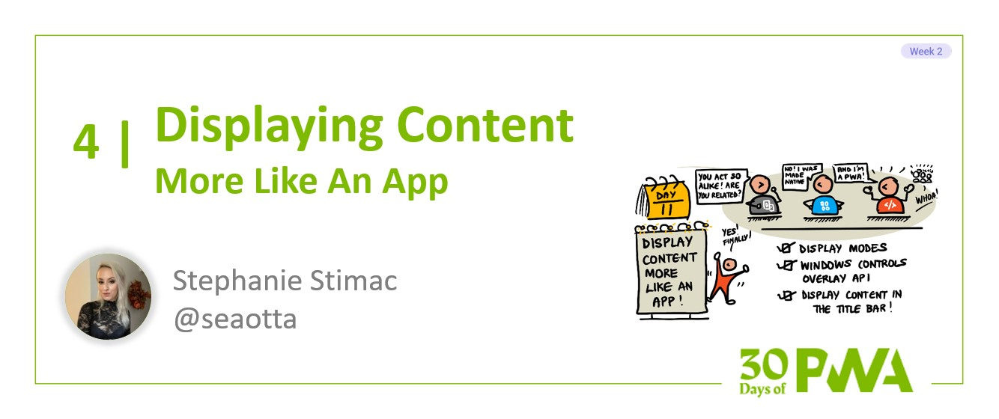
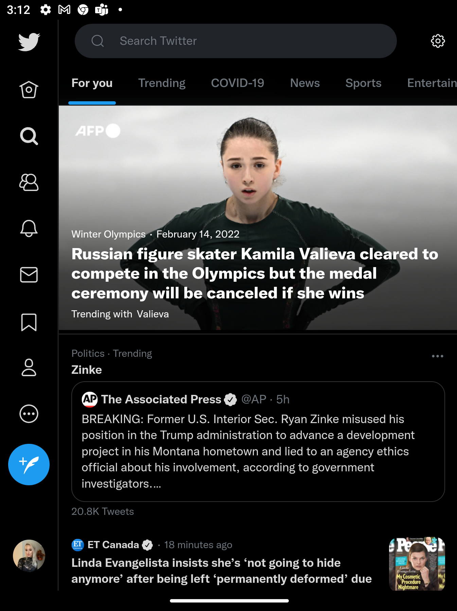
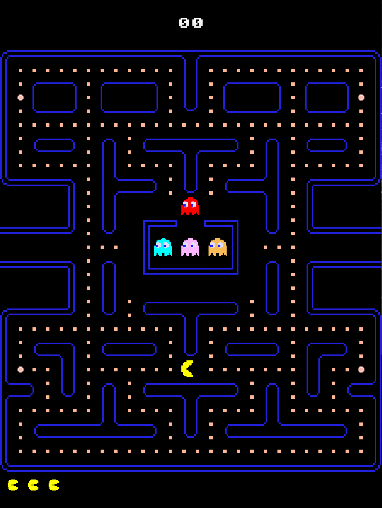

# Отображение содержимого как в приложении



<big>Добро пожаловать на **Неделю 2 День 4** из серии 30 Days of PWA! В сегодняшней статье мы рассмотрим различные режимы отображения, которые можно установить для своего сайта, а также экспериментальную функцию Window Controls Overlay, которая позволяет настраивать строку заголовка PWA.</big>

## Режимы отображения

Способ отображения прогрессивных веб-приложений в операционной системе после установки может отличаться от способа отображения приложения при открытии в веб-браузере. Например, на мобильном устройстве установленное PWA может отображаться на весь экран, а на настольной операционной системе - в виде отдельного окна.

Существует четыре различных режима отображения, и каждый из них обеспечивает различные возможности пользовательского интерфейса браузера, которые необходимо учитывать при выборе подходящего режима отображения для PWA.

Предпочтительный режим отображения задается с помощью элемента `display` манифеста веб-приложения, имеющего одно из следующих значений: `fullscreen`, `standalone`, `minimal-ui` или `browser`:

```json
{
    "display": "standalone"
}
```

Если браузер не поддерживает режим отображения, что возможно, так как он не является обязательным или поддерживает не все параметры режима отображения, то режим отображения будет [возвращаться к поддерживаемому](https://www.w3.org/TR/appmanifest/#dfn-fallback-chain) в таком порядке:

`fullscreen` --> `standalone` --> `minimal-ui` --> `browser`

### Автономный режим отображения

В режиме автономного отображения PWA выглядит и ведет себя наиболее похоже на приложение, предназначенное для конкретной платформы. Он открывается в окне, отличном от окна браузера, и скрывает все элементы пользовательского интерфейса браузера, такие как адресная строка. При этом сохраняются стандартные элементы системного пользовательского интерфейса, такие как кнопка "Назад" или "Закрыть окно". В этом режиме приложение также может иметь свой собственный значок в программе запуска приложений. Если `standalone` недоступен, то происходит возврат к режиму отображения `minimal-ui`. Twitter использует "`standalone`" для своих PWA.



### Полноэкранный режим отображения

Полноэкранный режим отображения занимает всю доступную область экрана и скрывает все элементы пользовательского интерфейса браузера. Если режим `fullscreen` недоступен, он переходит в режим `standalone`. Вот пример игры, в которой используется полноэкранный режим отображения.



Посмотреть PWA PacMan [здесь](https://bobrov.dev/pacman-pwa/index.html).

### Режим отображения "минимальный пользовательский интерфейс

Режим отображения "минимальный пользовательский интерфейс" позволяет создать PWA, аналогичный режиму автономного отображения. Он открывается в собственном окне, но приложение сохраняет минимальный набор элементов управления пользовательским интерфейсом браузера. В разных браузерах пользовательский интерфейс может быть разным. В OneDrive PWA используется режим отображения `minimal-ui`.


### Режим отображения в браузере

Режим отображения в браузере сохраняет все возможности браузера, при этом ваше веб-приложение не будет устанавливаться. Оно будет открываться в обычном окне или вкладке браузера. Если бы Twitter не использовал автономный режим, он отображался бы в браузере как обычная вкладка.


### Нацеливание на различные режимы отображения с помощью медиафункции `display-mode`.

В зависимости от режима отображения, выбранного для PWA, могут быть элементы, которые необходимо скрыть, когда веб-приложение открыто на вкладке браузера, особенно если вы запускаете его в режиме `standalone` или `fullscreen`, который скрывает кнопки пользовательского интерфейса браузера. Необходимо обеспечить возможность возврата назад при отсутствии кнопки "Назад". А может быть, необходимо немного изменить стили сайта, чтобы он лучше отображался в полноэкранном режиме.

Это можно сделать, ориентируясь на определенные режимы отображения с помощью медиафункции `display-mode`.

```css
.app-button {
    display: none;
}

@media (display-mode: standalone) {
    .app-button {
        display: block;
    }
}
```

В данном примере кнопка с классом `.app-button` будет отображаться только тогда, когда PWA находится в автономном режиме. Можно пойти еще дальше и использовать медиазапросы для изменения отображения объектов на небольших экранах по сравнению с настольными компьютерами, когда пользователь находится в автономном режиме.

## Дополнительная настройка параметров отображения с помощью Window Controls Overlay

Предыдущие режимы отображения, о которых я упоминал, в настоящее время позволяют настраивать только отображение под строкой заголовка на настольных PWA в автономном режиме. Window Controls Overlay - это экспериментальный вариант отображения, который позволит вам настраивать строку заголовка вашего PWA с помощью CSS и JavaScript. Она предоставляет доступ к пространству рядом с элементами управления, которые минимизируют, максимизируют или закрывают окно приложения.

Поскольку данная функция является экспериментальной и находится в стадии разработки, ее работа может быть изменена. Включить эту функцию в Chrome и Edge можно, перейдя по адресу `about://flags` и включив флаг `Desktop PWA Window Controls Overlay`.


Этот пример из [проекта спецификации](https://aka.ms/learn-PWA/30Days-2.4/wicg.github.io/window-controls-overlay) показывает, как область строки заголовка становится доступной при включенном WCO.

### Использование наложения оконных элементов управления

Для того чтобы использовать эту возможность, нам необходимо добавить `display_override` в файл манифеста нашего веб-приложения.

```json
{
    "display_override": ["window-controls-overlay"]
}
```

Настроенная строка заголовка будет отображаться только в отдельном окне PWA на настольной операционной системе. После использования `display_override` мы переходим к предпочтительному режиму отображения, когда наложение элементов управления окном недоступно.

```json
{
    "display_override": ["window-controls-overlay"],
    "display": "standalone"
}
```

Теперь, когда мы указали в манифесте, что хотим использовать наложение элементов управления окном, нам необходимо добавить некоторые CSS для позиционирования содержимого в области строки заголовка. Это можно сделать с помощью следующих [переменных окружения CSS](<https://developer.mozilla.org/docs/Web/CSS/env()>):

-   `titlebar-area-x`
-   `titlebar-area-y`
-   `titlebar-area-width`
-   `titlebar-area-height`

Использование этих переменных окружения будет выглядеть примерно так:

```css
.titleBar {
    position: fixed;
    left: env(titlebar-area-x, 0);
    top: env(titlebar-area-y, 0);
    width: env(titlebar-area-width, 100%);
    height: env(titlebar-area-height, 40px);
}
```

Переменная `titlebar-area-x` задает расстояние от левой части области просмотра до места, где появляется панель заголовка, с целым числом. Переменная `titlebar-area-y` определяет расстояние от вершины. А переменные `titlebar-area-width` и `titlebar-area-height` задают ширину и высоту, соответственно, со значениями `fallback`. Запасные значения используются, когда приложение не установлено, когда Window Controls Overlay не поддерживается или пользователь отказался от этой функции.

### Сохранение перетаскиваемой строки заголовка

После того как вы разместили и оформили строку заголовка, остается сделать еще один шаг. Если включено наложение элементов управления окном, то окно больше не может перетаскиваться, поэтому нам необходимо исправить это с помощью CSS-свойства `app-region`.

```css
.titleBar {
    position: fixed;
    left: env(titlebar-area-x, 0);
    top: env(titlebar-area-y, 0);
    width: env(titlebar-area-width, 100%);
    height: env(titlebar-area-height, 40px);
    -webkit-app-region: drag;
    app-region: drag;
}
```

Это CSS-свойство также является экспериментальным, поэтому для его работы требуется `-webkit-app-region`, и оно поддерживается только в браузерах на базе Chromium.

## Ресурсы.

-   [MDN `display-mode`](https://developer.mozilla.org/docs/Web/CSS/@media/display-mode)
-   [App Design: Display Modes](https://web.dev/learn/pwa/app-design#display-modes)
-   [WCO: Выходя за рамки](https://alistapart.com/article/breaking-out-of-the-box/)

## Резюме

Режимы отображения - это простой способ сделать PWA похожим на приложение для конкретной платформы, который задается с помощью элемента манифеста веб-приложения `display`. Возможность дополнительной настройки области строки заголовка для создания еще большего ощущения настольного приложения, когда PWA отображается в отдельном окне, доступна с помощью экспериментальной настройки Window Controls Overlay, доступной в браузерах Chromium.

Настройтесь на завтрашний [следующий пост](./05.md), где мы рассмотрим кэширование.

## Упражнение

Выберите [пример приложения](https://learn.microsoft.com/en-us/microsoft-edge/progressive-web-apps-chromium/demo-pwas) и измените режимы отображения в манифесте, чтобы увидеть, как каждый из них отображается при открытии. Какие функции отсутствуют или добавляются в каждом режиме отображения? Как изменяется пользовательский интерфейс?
