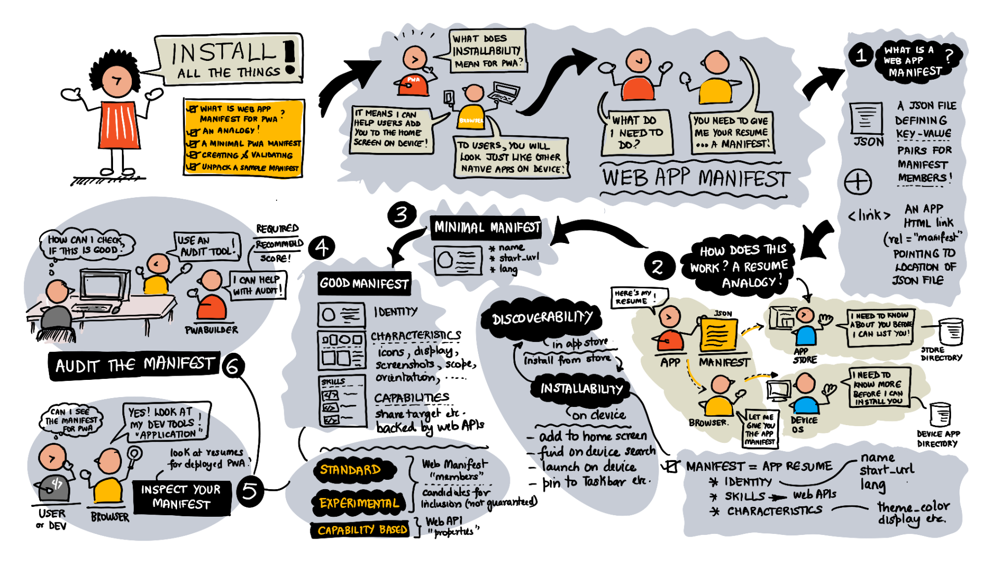
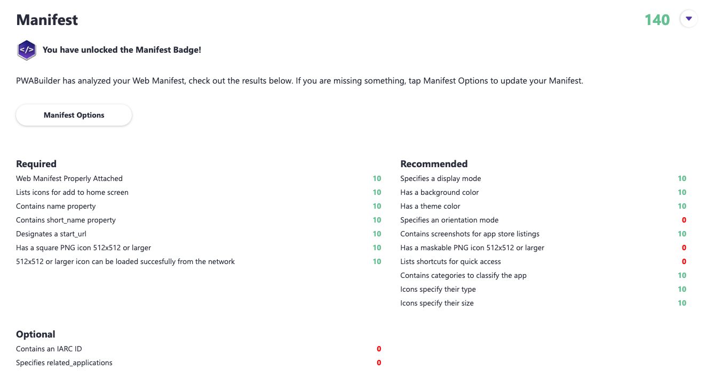

# Сделайте PWA устанавливаемым

<big>Добро пожаловать на **День 3** проекта #30DaysOfPWA! Хотите узнать больше об этом проекте? Ознакомьтесь с нашим постом [Вступление](../index.md), чтобы получить более подробную информацию о дорожной карте и участниках. А теперь давайте погрузимся в работу!</big>


!!!tip "Что вы узнаете сегодня"

    -   Что такое манифест веб-приложения?
    -   Что должен содержать минимальный манифест PWA?
    -   Как свойства манифеста определяют возможности PWA?
    -   Как создать и проверить манифест Web App Manifest?

## Давайте подведем итоги

-   [День 1](./01.md): Мы узнали, что PWA - это веб-приложения, которые _прогрессивно совершенствуются_ для обеспечения взаимодействия с устройствами и платформами, которые **масштабируются в зависимости от их возможностей**. На более функциональных платформах они могут вести себя как специфические для платформы приложения, а на менее функциональных - возвращаться к поведению обычного веб-сайта.
-   [День 2](./02.md): Мы узнали, что это возможно благодаря _открытым веб-технологиям_, таким как сервис-воркеры, Web App Manifest, HTTPS и поддержка современных веб-интерфейсов. Это позволяет обеспечить такие желаемые характеристики PWA, как **устанавливаемость** и **сетевая независимость**, совместимые с кросс-браузерами.

Кроме того, мы выбрали [Sample PWA](https://learn.microsoft.com/en-us/microsoft-edge/progressive-web-apps-chromium/demo-pwas) для изучения концепций. Теперь давайте погрузимся в строительные блоки PWA, начав с манифестов.

## Что такое манифест Web App Manifest?

Устанавливаемость - это необходимая характеристика PWA, которая позволяет добавлять их на главный экран устройства и вести себя так же, как и другие приложения для конкретной платформы - например, пользователи могут запускать их, закреплять на Панели задач, находить через поиск на устройстве и т.д.

Манифест **Web App Manifest** - это открытая веб-спецификация [спецификация формата JSON](https://learn.microsoft.com/en-us/microsoft-edge/progressive-web-apps-chromium/how-to/web-app-manifests), которая имеет решающее значение для обеспечения возможности установки PWA. [Функционально](https://learn.microsoft.com/en-us/microsoft-edge/progressive-web-apps-chromium/how-to/web-app-manifests) он определяет, как выглядит и ведет себя PWA при установке на устройство, определяя свойства (пары ключ-значение), которые характеризуют его внешний вид и поведение. Другими словами, он описывает детали вашего веб-приложения, такие как название, описание, иконки и т.д.

## Пример манифеста PWA

Давайте посмотрим, как выглядит реальный манифест на примере [Sample PWA](https://learn.microsoft.com/en-us/microsoft-edge/progressive-web-apps-chromium/demo-pwas). Я использую [DevTool Tips](https://devtoolstips.org/) - и могу просмотреть его манифест двумя способами:

-   **Из времени выполнения.** Во [вчерашнем посте](./02.md) мы научились _инспектировать_ приложение с помощью DevTools браузера, чтобы найти раздел Manifest на вкладке Application.
-   **Из источника.** Ищите файл [manifest.json](https://raw.githubusercontent.com/captainbrosset/devtools-tips/main/src/manifest.json). Приложения могут использовать соглашение об именовании `app_name.webmanifest`, если они предоставляют его с MIME-типом `application/manifest+json`. Внутри тега `<head>` страницы можно найти `<link rel="manifest" href="manifest.json">`. В `href` будет указано имя файла манифеста.

Вот как выглядит _manifest.json_ моего примера PWA.

```json
{
    "name": "DevTools Tips",
    "short_name": "DevTools Tips",
    "start_url": "/",
    "categories": [
        "productivity",
        "devtools",
        "browser",
        "education"
    ],
    "display": "standalone",
    "background_color": "#ffffff",
    "theme_color": "#ffffff",
    "scope": "/",
    "description": "A collection of useful cross-browser DevTools tips",
    "icons": [
        {
            "src": "/assets/logo-192.png",
            "sizes": "192x192",
            "type": "image/png"
        },
        {
            "src": "/assets/logo-512.png",
            "sizes": "512x512",
            "type": "image/png"
        }
    ],
    "screenshots": [
        {
            "src": "/assets/screenshot-home.png",
            "sizes": "1992x1773",
            "type": "image/png"
        },
        {
            "src": "/assets/screenshot-tip.png",
            "sizes": "1992x1773",
            "type": "image/png"
        }
    ],
    "url_handlers": [
        {
            "origin": "https://devtoolstips.org"
        }
    ]
}
```

## Манифесты - это как резюме

Многовато для восприятия, верно? Полезно, если вы можете разложить эти свойства на несколько групп - вот что я вижу:

-   _Идентификация_ - например, название, категории, начальный URL.
-   _Характеристики_ - например, иконки, цвета, скриншоты.
-   _Возможности_ - например, url_handlers.

Подождите - не напоминает ли это вам резюме? Идентификационные данные, снимки профиля, список навыков? Именно так я и думаю:

-   Web App Manifest - это как резюме приложения.
-   Браузер - это место, где приложение "работает" в данный момент.
-   **Устанавливаемость** - это "собеседование" для работы на новом месте (на устройстве).
-   **Доступность** обеспечивается за счет "публикации" резюме приложения (в магазинах приложений).

Наглядный пример объясняет, как эта аналогия работает для PWA.



Браузер похож на замечательное рабочее место, где люди заботятся о вашем успехе. PWA - это приложения, которые "работают" там - они ведут обновляемое "резюме" (манифест) и "ссылаются" на него в своем HTML, чтобы сообщить браузеру, что они могут работать "удаленно" (на устройстве). Браузер использует его для "рекламы" пользователям ("Install This Site As An App"). Логично?

Если пользователь нажимает на кнопку `Install`, то начинается "собеседование" между приложением и новым рабочим местом (устройством), которое просматривает резюме на предмет деталей (профиль, внешность, навыки) и добавляет его в свой локальный "каталог рабочих мест", как и другие приложения для конкретной платформы. Теперь пользователи могут _запустить_ приложение или _обнаружить_ его с помощью функций поиска, характерных для конкретного устройства. А пользователи и другие приложения теперь могут нацеливать это приложение на выполнение задач, соответствующих его перечисленным _возможностям_ ("обработка url"). Разве это не здорово?

Но подождите - это еще не все. PWA также может публиковать свое резюме в магазинах приложений, как и приложения для конкретной платформы (публикация в [например, Microsoft Store](https://learn.microsoft.com/en-us/microsoft-edge/progressive-web-apps-chromium/how-to/microsoft-store) для Windows-устройств). Когда пользователи `устанавливают` из магазина приложений, они просто запускают тот же самый процесс собеседования. **Устанавливаемость и доступность** - в выигрыше!

## Создание манифеста веб-приложения

С точки зрения разработчика PWA создание манифеста включает в себя:

-   Создание файла `manifest.json` и заполнение его свойств.
-   Привязка его к HTML приложения для рекламы статуса PWA. Например:

```html
<link rel="manifest" href="/manifest.json" />
```

Создайте свой манифест с помощью любого текстового редактора или IDE - только убедитесь, что JSON корректен. Начните с минимального манифеста, чтобы получить работающий PWA. Затем итеративно добавляйте новые [элементы](https://developer.mozilla.org/ru/docs/Web/Manifest) для улучшения работы PWA. Затем добавьте атрибуты возможностей, связанные с [Web API](https://developer.mozilla.org/en-US/docs/Web/API), которые вы поддерживаете.

Проведите аудит PWA с помощью таких инструментов, как [PWABuilder](https://www.pwabuilder.com/), чтобы найти и устранить проблемы в манифесте и предоставить пользователям лучшие в своем классе возможности PWA.

## Что нужно для минимального манифеста?

В [спецификации](https://w3c.github.io/manifest/#examples) определено множество атрибутов _членов_, но предлагаемый [минимальный манифест](https://learn.microsoft.com/en-us/microsoft-edge/progressive-web-apps-chromium/how-to/web-app-manifests) должен содержать как минимум эти три атрибута - _start_url_ определяет точку входа (показан путь по умолчанию) при запуске приложения на устройстве.

```json
{
    "name": "My Sample PWA",
    "lang": "en-US",
    "start_url": "/"
}
```

Удобное описание поддерживаемых членов можно прочитать [здесь](https://developer.mozilla.org/ru/docs/Web/Manifest) - для примера посмотрим, что декларирует наш пример PWA:

-   `short_name` - имя приложения для ограниченных пространств (например, домашний экран)
-   `categories` - подсказки для магазинов или каталогов приложений. (См. W3C [examples](https://github.com/w3c/manifest/wiki/Categories))
-   `display` - какую часть пользовательского интерфейса браузера пользователь видит в приложении?
-   `background_color` - место для отображения (до загрузки таблицы стилей)
-   `theme_color` - цвет темы по умолчанию для приложения
-   `scope` - какие веб-страницы могут быть просмотрены (область навигации)
-   `description` - о чем приложение?
-   `icons` - массив изображений иконок, используемых в различных контекстах
-   `screenshots` - демонстрация UI/UX приложения (например, для магазинов приложений)

## Что такое _хороший_ манифест?

Хороший манифест содержит дополнительные свойства, которые помогают обеспечить оптимальный опыт для пользователя на данном устройстве. Это может включать:

-   добавление _рекомендованных_ членов и _экспериментальных_ членов
-   добавление свойств для раскрытия новых _возможностей_ на устройстве.

Для первой части можно использовать такие инструменты аудита, как [PWABuilder](https://www.pwabuilder.com/), которые оценивают качество манифеста и помогают устранить проблемы в интерактивном режиме (см. пример ниже). Более подробную информацию ищите в нашем материале [Week 3: Developer Tools](../dev-tools/index.md).



Во второй части мы поговорили о двух вещах

**Экспериментальные члены**. Это члены манифеста, которые оцениваются на предмет включения в будущем, но могут быть изменены. Браузерные платформы могут предлагать ранние реализации под [флагом](https://learn.microsoft.com/en-us/microsoft-edge/progressive-web-apps-chromium/how-to/handle-urls#enable-url-handling) для оценки - но следует помнить, что они могут измениться и неравномерно поддерживаться в разных браузерах.

-   _Пример_: В нашем примере PWA объявлен член "url_handlers". Это [экспериментальная функция](https://learn.microsoft.com/en-us/microsoft-edge/progressive-web-apps-chromium/how-to/handle-urls), которая позволяет приложению регистрировать себя в качестве цели запуска, когда пользователь хочет открыть связанные с ним URL-адреса. В настоящее время предлагается заменить его членом ["handle_links"](https://github.com/WICG/pwa-url-handler/blob/main/handle_links/explainer.md).

**Веб-возможности**. В манифесте может быть заявлена поддержка использования новых [Web API](https://developer.mozilla.org/ru/docs/Web/API), которые открывают приложениям доступ к богатому аппаратному обеспечению и возможностям платформы.

-   _Пример_: ["share_target"](https://learn.microsoft.com/en-us/microsoft-edge/progressive-web-apps-chromium/how-to/web-app-manifests#identify-your-app-as-a-share-target) (используется с [Web Share API](https://developer.mozilla.org/en-US/docs/Web/API/Web_Share_API)) активизирует возможность PWA [делиться контентом с другими приложениями](https://learn.microsoft.com/en-us/microsoft-edge/progressive-web-apps-chromium/how-to/share), как и любое другое приложение, ориентированное на конкретную платформу. О расширенных возможностях мы поговорим во второй неделе.

И последнее замечание. Помните нашу аналогию с манифестом как резюме для PWA? Где "члены" манифеста отражают различные разделы, связанные с идентичностью, характеристиками и возможностями?

Думайте о _web capabilities_ и других открытых веб-технологиях (например, сервис-воркерах) как о **rolodex** товарищей по команде, к которым это приложение может обратиться для выполнения работы. Теперь они могут указать эти навыки в своем резюме, поскольку они _способны_ выполнять эту работу. Однако их способность выполнять эту работу на данном устройстве зависит от _доступности_ этих товарищей по команде. Считайте, что "обнаружение возможностей" эквивалентно _звонку_, чтобы узнать, есть ли рядом нужный коллега, прежде чем брать на себя обязательства по поддержке этой задачи.

## Упражнение: Проверка образца манифеста PWA

Сегодня мы многое узнали, и теперь ваша очередь учиться, активно изучая концепции. Выберите другой [Sample App](https://learn.microsoft.com/en-us/microsoft-edge/progressive-web-apps-chromium/demo-pwas).

-   Просмотрите его манифест в DevTools. Какие [члены](https://developer.mozilla.org/ru/docs/Web/Manifest) в нем определены?
-   Проведите аудит с помощью [PWABuilder](https://www.pwabuilder.com/). Какие пробелы он выявил?
-   Исследуйте манифест.
    -   Используются ли какие-либо экспериментальные члены? Что они делают?
    -   Заявлены ли какие-либо возможности? Какие [Web API](https://developer.mozilla.org/en-US/docs/Web/API) стоят за ними?

---

:material-information-outline: Источник &mdash; [1.3 Make PWA Installable](https://microsoft.github.io/win-student-devs/#/30DaysOfPWA/core-concepts/03)
