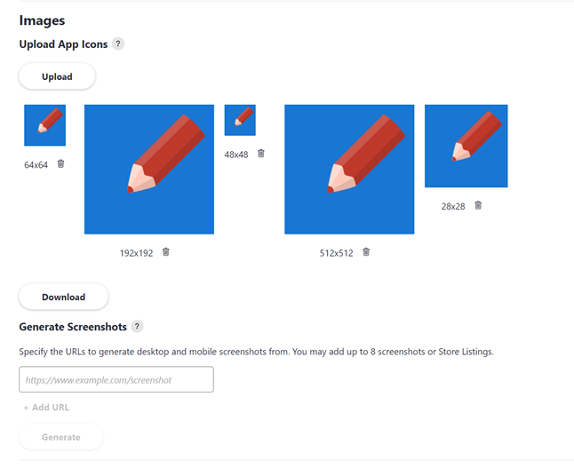
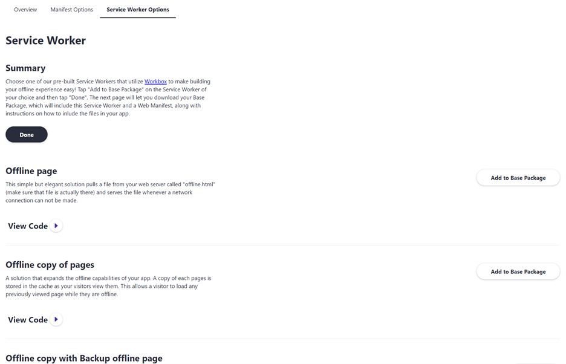

# Преобразование веб-приложения в PWA

Добро пожаловать на **неделю 3, день 2** из серии [30 дней PWA](https://aka.ms/learn-pwa/30Days-blog)! Вчера мы говорили о том, какие существуют инструменты для создания качественного PWA с нуля. Сегодня мы поговорим о PWABuilder.com, еще одном предложении в рамках проекта PWABuilder, которое позволяет легко оценить и опубликовать PWA в различных магазинах приложений.

## Что такое PWABuilder?

PWABuilder — это проект, призванный сделать создание и упаковку PWA хорошего качества удобным для разработчиков. [PWABuilder.com](https://aka.ms/learn-PWA/30Days-3.2/www.pwabuilder.com) — это универсальное средство, позволяющее оценить и опубликовать PWA в магазинах приложений за считанные минуты. Он стремится достичь следующих целей:

-   Создать и опубликовать пакет PWA в нескольких магазинах приложений, таких как магазин Microsoft. Это избавляет от необходимости разбираться в специфическом коде или базовых платформах для отправки в эти магазины.
-   Оценка качества PWA путем анализа манифеста и сервис-воркера, а также выдача рекомендаций по улучшению PWA.
-   Редактирование манифеста и добавление более продвинутых функций в сервис-воркер. Это означает, что даже если у вас не PWA-сайт, вы можете легко превратить его в PWA, просто выбрав нужные "ингредиенты" из предлагаемых нами вариантов манифеста и сервис-воркера.

Интересный факт: PWABuilder.com сам по себе является PWA! Он также является полностью [открытым исходным кодом](https://aka.ms/learn-PWA/30Days-3.2/github.com/pwa-builder/PWABuilder), как и все остальные замечательные инструменты, входящие в состав пакета PWABuilder.

## Как это работает

Теперь давайте подробно рассмотрим, чем может быть полезен PWABuilder. В качестве PWA мы будем использовать [Webboard](https://aka.ms/learn-PWA/30Days-3.2/webboard.app), приложение для создания белых досок с открытым исходным кодом.

Сначала мы вводим URL-адрес на главной странице PWABuilder.

Вы попадете на страницу с отчетом, где будет показана ваша оценка по каждому компоненту PWA. Как видно, оценка разделена на три секции: Манифест, Сервис-воркер и Безопасность. В каждом из этих разделов имеется ряд пунктов, по которым оценивается PWA. Это делается для того, чтобы убедиться в том, что PWA соответствует всем критериям и стандартам качества, чтобы его можно было использовать, обеспечить безопасность и легко обнаружить в любом из магазинов приложений.

На вкладке "Manifest Options" вы можете добавить больше деталей в свой манифест. Здесь можно сгенерировать иконки всех размеров, необходимых для различных магазинов приложений, а также скриншоты, которые будут отображаться на страницах с подробным описанием продукта (PDP), когда пользователь будет искать ваше приложение в магазине. Чтобы узнать больше о манифесте веб-приложения и о том, почему он важен, обратитесь к одной из наших [предыдущих статей](https://microsoft.github.io/win-student-devs/#/30DaysOfPWA/core-concepts/03).

Если у вас нет сервис-воркера или вы хотите улучшить существующий, перейдите на вкладку "Параметры сервис-воркера". Здесь представлен код для сервис-воркеров, предлагающих расширенные функциональные возможности, такие как работа в автономном режиме и кэширование медиафайлов. Более подробно о сервис-воркерах можно прочитать в [этой статье](https://microsoft.github.io/win-student-devs/#/30DaysOfPWA/core-concepts/04).

Когда вы будете удовлетворены всеми сделанными изменениями, можно приступать к публикации! PWABuilder.com генерирует пакеты для вашего PWA для многих магазинов приложений, таких как Microsoft Store, iOS App store и Google Play Store.

Вот и все, друзья! Вот так быстро вы можете преобразовать свой сайт в PWA или добавить к существующему PWA дополнительные возможности богатой платформы, которые затем можно опубликовать в различных магазинах приложений!

## Почему стоит использовать PWABuilder?

Простое наличие манифеста веб-приложения и сервис-воркера не всегда делает PWA хорошим. Такие инструменты, как [PWABuilder.com](https://aka.ms/learn-PWA/30Days-3.2/www.pwabuilder.com), [pwa-starter](https://aka.ms/learn-PWA/30Days-3.2/github.com/pwa-builder/pwa-starter) и расширение VS Code [PWA Studio](https://aka.ms/learn-PWA/30Days-3.2/pwa-studio), могут помочь вашему приложению раскрыть свой потенциал, используя все возможности технологии PWA. Независимо от того, хотите ли вы начать создание приложения с нуля или вам просто нужны дополнительные функции, чтобы ваше PWA засияло, эти инструменты помогут вам добиться желаемого. Следите за новостями!

## Упражнение

Попробуйте воспользоваться PWABuilder.com сегодня, используя сайт/PWA, над которым вы работаете. Запустите PWA через PWABuilder, добавьте дополнительные возможности в сервис-воркер и сделайте его готовым к публикации, заполнив все поля в манифесте. Попробуйте сгенерировать тестовый пакет на платформе Windows на странице публикации и загрузить его с боковой стороны. Когда вы почувствуете, что ваш PWA готов, попробуйте опубликовать его в одном из магазинов приложений.

## Ресурсы

-   [GitHub-репозиторий PWABuilder — поднимите проблему или внесите свой вклад, чтобы сделать PWABuilder еще лучше!](https://aka.ms/learn-PWA/30Days-3.2/github.com/pwa-builder/PWABuilder)
-   [Присоединяйтесь к Discord-серверу PWABuilder!](https://aka.ms/learn-PWA/30Days-3.2/discord.gg/f3my6ruZ)
-   [PWA Studio — наше расширение VS Code](https://aka.ms/learn-PWA/30Days-3.2/pwa-studio)
-   [PWA Starter — шаблон для создания PWA с нуля](https://aka.ms/learn-PWA/30Days-3.2/github.com/pwa-builder/pwa-starter)
