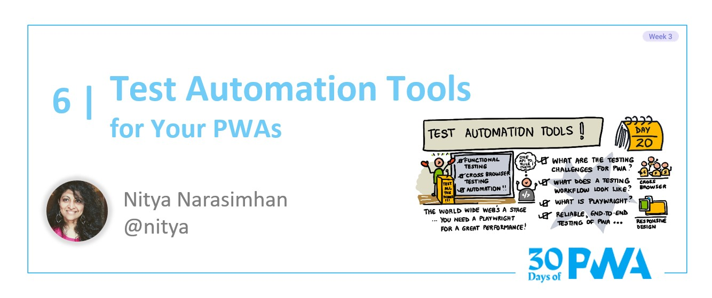
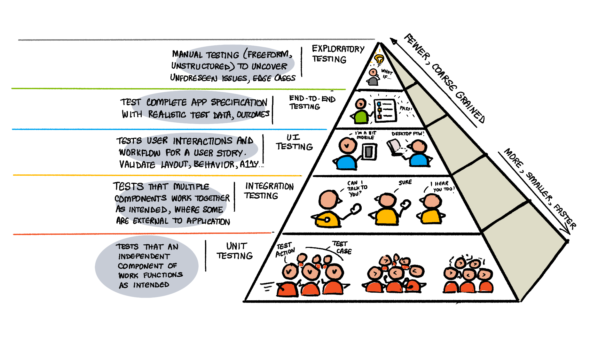
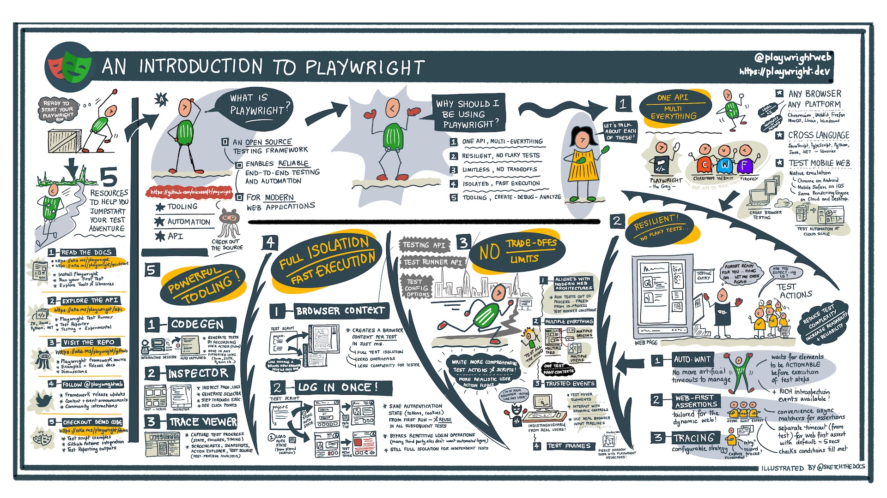
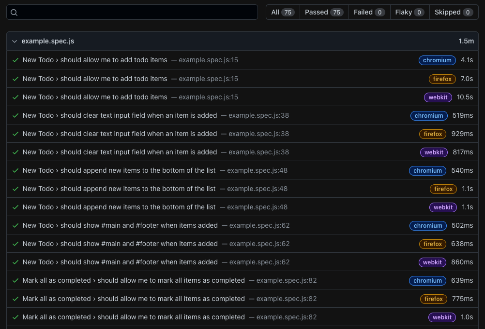
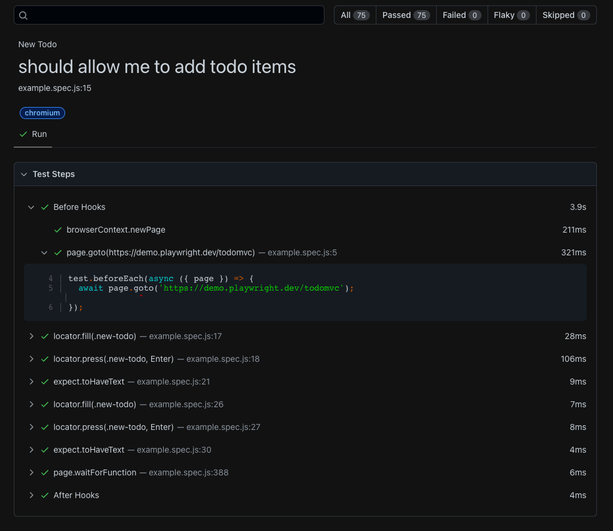

# Средства автоматизации тестирования

Добро пожаловать на 3-ю неделю, **день 6** #30DaysOfPWA. Ознакомьтесь с нашим постом [вступление](../index.md), чтобы узнать о нашей дорожной карте и участниках. В сегодняшнем посте мы поговорим об автоматизации тестирования — что это такое, почему она важна, а также об инструментах разработчика, которые помогут нам построить надежные процессы сквозного тестирования для наших PWA.



## ЧТО МЫ РАССМОТРИМ СЕГОДНЯ

| Раздел | Описание |
| --- | --- |
| **Автоматизация тестирования** | Что это такое и почему она важна для современных веб-приложений? |
| **Пирамида тестирования** | Что включает в себя стратегия тестирования современных веб-приложений? |
| **Тестирование PWA** | Что нужно для функционального тестирования PWA? |
| **Привет, Playwright** | Надежный фреймворк сквозного тестирования для современных веб-приложений. |
| **Использование Playwright** | Ознакомьтесь с быстрыми стартами, мощными инструментами и сценариями тестирования PWA. |
| **Упражнение** | Испытайте Playwright на примере PWA! |

---

## Автоматизация тестирования

Автоматизация тестирования — это практика автоматического выполнения тестов для проверки функциональности программного продукта и последующего использования результатов тестирования для итеративного улучшения качества продукта. Автоматизация тестирования является ключевым элементом непрерывной поставки в современной культуре DevOps: конвейеры сборки-развертывания поддерживают программные продукты в состоянии постоянной готовности к выпуску.

Зачем изучать автоматизацию тестирования для PWA? Две причины: растущая сложность тестирования и улучшение инструментальных возможностей.

### Сложность тестирования

Прогрессивные веб-приложения сочетают в себе возможности традиционных веб-приложений с более богатыми возможностями приложений для конкретных платформ. В первом случае необходимо _кроссбраузерное_ тестирование для обеспечения работоспособности во всех целевых браузерах. Второе требует стратегий тестирования _прогрессивных улучшений_ для подтверждения расширенных возможностей, доступных на более мощных устройствах.

Увеличение частоты тестирования (например, при каждом обновлении или исправлении ошибок) в сочетании с большим количеством градаций тестирования (модульное, интеграционное, сквозное) и конфигураций (браузеры, платформы устройств) делает ручное тестирование трудоемким и чреватым ошибками. Именно в этом случае автоматизация тестирования позволяет сократить время обнаружения проблем, исключить ошибки операторов и эффективно масштабироваться с помощью облачных ресурсов.

### Инструментальные возможности

Благодаря богатой экосистеме инструментов и технологий, доступных веб-разработчикам, внедрение стратегий автоматизированного тестирования сегодня не вызывает сомнений. Современное программное обеспечение для автоматизации веб-процессов может выполнять действия пользователя и другие операции в браузере без участия человека. Ознакомьтесь с документацией [Microsoft Edge docs](https://aka.ms/learn-PWA/30Days-3.6/docs.microsoft.com/en-us/microsoft-edge/test-and-automation/test-and-automation), чтобы узнать больше о соответствующих инструментах и технологиях тестирования для веб-разработки, включая:

-   _[WebDriver](https://aka.ms/learn-PWA/30Days-3.6/docs.microsoft.com/en-us/microsoft-edge/webdriver-chromium/c-sharp)_ — стандартный протокол W3C для внепроцессных клиентов, позволяющий удаленно инструктировать браузеры.
-   _[Протокол DevTools](https://aka.ms/learn-PWA/30Days-3.6/docs.microsoft.com/en-us/microsoft-edge/devtools-protocol-chromium)_ — прямой осмотр, отладка и профилирование браузеров на базе Chromium, таких как Edge.
-   _[Puppeteer](https://aka.ms/learn-PWA/30Days-3.6/docs.microsoft.com/en-us/microsoft-edge/puppeteer)_ — библиотека Node.js для автоматизации работы браузеров с использованием протокола DevTools.
-   _[Playwright](https://aka.ms/learn-PWA/30Days-3.6/docs.microsoft.com/en-us/microsoft-edge/playwright)_ — _фреймворк_ для надежного сквозного тестирования современных веб-приложений во всех браузерах.
-   _[webhint](https://aka.ms/learn-PWA/30Days-3.6/docs.microsoft.com/en-us/microsoft-edge/test-and-automation/webhint)_ — линтер для обеспечения доступности, производительности, безопасности, PWA и кроссбраузерной совместимости.

В этом посте мы остановимся на [_Playwright_](https://aka.ms/learn-PWA/30Days-3.6/playwright.dev), но изучите и другие ресурсы, чтобы понять, как они впишутся в ваш набор инструментов для тестирования.

## Пирамида тестирования

Для разработки стратегии Agile-тестирования полезно использовать визуальные метафоры, такие как эта [практическая пирамида тестов](https://aka.ms/learn-PWA/30Days-3.6/www.pearson.com/us/higher-education/program/Cohn-Succeeding-with-Agile-Software-Development-Using-Scrum/PGM201415.html), которая организует наше мышление вокруг двух руководящих принципов:

1.  писать тесты с разной степенью детализации и
2.  писать все меньше тестов по мере продвижения вверх по пирамиде.

Что означает гранулярность тестирования? В моем варианте пирамиды в основании лежит модульное тестирование, а на вершине — исследовательское тестирование. Автоматизация тестирования помогает в работе с нижними четырьмя слоями, в то время как ручное тестирование является ключом к обнаружению "пробелов", которые автоматическое тестирование может пропустить на вершине.



Реализуя эту стратегию, мы хотим получить _множество мелких, быстрых тестов_ в основании, и _меньше более грубых тестов_ по мере продвижения вверх. Существует множество библиотек и инструментов для модульного тестирования, которые делают первую цель достижимой. Однако автоматизация сквозного тестирования может быть ["печально известной"](https://aka.ms/learn-PWA/30Days-3.6/martinfowler.com/articles/practical-test-pyramid.html#TheImportanceOftestAutomation), учитывая множество "причуд браузера, временных проблем, анимации и неожиданных взаимодействий с пользовательским интерфейсом", с которыми нам приходится иметь дело.

Именно здесь нам поможет надежный фреймворк для тестирования, такой как Playwright. Его [тестовые иерархии](https://aka.ms/learn-PWA/30Days-3.6/playwright.dev/docs/api/class-suite#suite-tests) позволяют легко составлять высокоуровневые наборы тестов из низкоуровневых тестовых примеров, а также использовать _тестовые конфигурации_ с несколькими тестовыми проектами для обеспечения максимальной гибкости. Программа [Test Runner](https://aka.ms/learn-PWA/30Days-3.6/playwright.dev/docs/intro) может сосредоточиться на выполнении, параллельно запуская тесты для повышения эффективности, используя несколько проектов для кросс-браузерного покрытия и захватывая трассы для анализа после выполнения.

## Тестирование PWA

Далее давайте подумаем о _функциональной_ спецификации этих тестов — какие виды функций (модульное тестирование) и рабочих процессов взаимодействия (сквозное тестирование) мы должны рассматривать для Progressive Web Apps? Вот один из вариантов такого подхода:

-   **PWA — это веб-приложения.** Начните с существующих ["стратегий проведения тестирования"](https://aka.ms/learn-PWA/30Days-3.6/developer.mozilla.org/en-US/docs/Learn/Tools_and_testing/Cross_browser_testing/Testing_strategies) для веб-приложений и определите оптимальные конфигурации тестирования (целевые устройства, браузеры) для вашей целевой аудитории.
-   **PWA имеют дополнительные [желательные характеристики](../core-concepts/01.md)**, которые необходимо подтвердить. Из [предыдущего сообщения](05.md) известно, что здесь идеально подходят _инструменты аудита_, которые могут быть интегрированы в рабочий процесс автоматизации тестирования, если они имеют программируемый интерфейс. Например, [playwright-lighthouse](https://aka.ms/learn-PWA/30Days-3.6/github.com/abhinaba-ghosh/playwright-lighthouse) позволяет легко запускать аудит Lighthouse как часть рабочего процесса сквозного тестирования.
-   **PWA могут иметь требования к функциональному тестированию** для основных компонентов, которые можно автоматизировать. Например, мы можем [эмулировать автономный режим](https://aka.ms/learn-PWA/30Days-3.6/playwright.dev/docs/api/class-browsercontext#browser-context-set-offline) для тестирования сервис-воркеров и стратегий кэширования. Прочитайте эту статью [тестирование сервис-воркеров](https://aka.ms/learn-PWA/30Days-3.6/medium.com/dev-channel/testing-service-workers-318d7b016b19), чтобы получить полезные рекомендации.
-   **PWA могут использовать новые или экспериментальные [веб-возможности](../advanced-capabilities/01.md)**, которые неравномерно поддерживаются браузерами и устройствами. Мы можем использовать функцию [feature detection](https://aka.ms/learn-PWA/30Days-3.6/developer.mozilla.org/en-US/docs/Learn/Tools_and_testing/Cross_browser_testing/Feature_detection) для проверки их наличия на целевых устройствах и выполнения условных тестовых действий в зависимости от результата.

Но как реализовать эти спецификации для надежного сквозного тестирования? Давайте поговорим о Playwright!

## Здравствуй, Playwright!

[Playwright](https://aka.ms/learn-PWA/30Days-3.6/playwright.dev) — это фреймворк тестирования с открытым исходным кодом, обеспечивающий надежное сквозное тестирование и автоматизацию современных веб-приложений. Он поставляется со встроенным [Playwright Test Runner](https://aka.ms/learn-PWA/30Days-3.6/playwright.dev/docs/next/intro) для автоматизации тестирования и [Playwright Library](https://aka.ms/learn-PWA/30Days-3.6/playwright.dev/docs/next/library) для упрощения интеграции со сторонними решениями.



Playwright обладает рядом преимуществ, выгодно отличающих его от других фреймворков автоматизации тестирования. Более подробно о каждом из них можно прочитать в наглядном руководстве:

-   Унифицированный [API](https://aka.ms/learn-PWA/30Days-3.6/playwright.dev/docs/next/api/class-playwright) для использования в различных браузерах и платформах устройств.
-   Он позволяет проводить мобильное веб-тестирование с помощью [нативной эмуляции](https://aka.ms/learn-PWA/30Days-3.6/playwright.dev/docs/emulation) и богатых [профилей устройств](https://aka.ms/learn-PWA/30Days-3.6/github.com/microsoft/playwright/blob/bdfe92f8a7499644c431c5c05de17d71e6006084/packages/playwright-core/src/server/deviceDescriptorsSource.json).
-   Поддержка нескольких языков, включая TypeScript, JavaScript, Java, Python и .NET.
-   Тестирование без сбоев — благодаря [автоожиданию](https://aka.ms/learn-PWA/30Days-3.6/playwright.dev/docs/actionability) и [web-first assertions](https://aka.ms/learn-PWA/30Days-3.6/playwright.dev/docs/test-assertions) исключены нежелательные таймауты.
-   Никаких ограничений — совместимость с современными веб-архитектурами, работа вне процесса и поддержка многопользовательской работы.
-   Мощные инструменты — для создания, отладки, профилирования и отчетности по тестам и их выполнению.
-   Полная изоляция — с готовыми контекстами браузера в ms, быстрым выполнением и возможностью [распараллеливания](https://aka.ms/learn-PWA/30Days-3.6/playwright.dev/docs/test-parallel).

Хотите получить практический опыт работы с различными возможностями? Загляните в репозиторий [demo.playwright](https://aka.ms/learn-PWA/30Days-3.6/github.com/MarcusFelling/demo.playwright), где представлены примеры кода, демонстрирующие сценарии тестирования доступности, андроида, аутентификации, производительности (DevTools & Lighthouse) и визуального сравнения. Кроме того, узнайте, как такие возможности [Continuous Integration](https://aka.ms/learn-PWA/30Days-3.6/playwright.dev/docs/ci), как GitHub Actions, работают с Playwright без проблем, прямо из коробки.

## Использование Playwright

В настоящее время Playwright имеет две опции, позволяющие начать процесс сквозного тестирования:

-   Используйте руководство [Начало работы](https://aka.ms/learn-PWA/30Days-3.6/playwright.dev/docs/intro) для использования Playwright из командной строки.
-   Использовать расширение [Playwright Test для VSCode](https://aka.ms/learn-PWA/30Days-3.6/ms-playwright.playwright) (_в предварительном просмотре_) для использования Playwright из IDE.

Пока мы будем использовать первый вариант, поскольку расширение находится в стадии предварительного просмотра и работает только с последней версией Playwright Test. В одном из предыдущих постов я рассказывал о [превращении существующего приложения в PWA](../core-concepts/07.md). Сегодня я вернусь к этому проекту и настрою его на сквозное тестирование с помощью Playwright. Готовы? Приступим.

### 1. Установите Playwright

Поскольку я создаю тесты Playwright для _существующего_ проекта, я использую приведенную ниже команду. Если вы _создаете_ новый проект, просто добавьте имя проекта в качестве последнего аргумента.

```
$ npm init playwright
```

Выходные данные выглядят так, как показано на рисунке (сжаты для наглядности). Обратите внимание, что во время настройки можно выбрать инструментарий для работы с GitHub Actions. В первый раз процесс установки может занять некоторое время, поскольку по умолчанию устанавливается Playwright (тестовый прогон и библиотека) и все поддерживаемые браузеры (Chromium, Firefox и Webkit).

```
Need to install the following packages:
  create-playwright
Ok to proceed? (y) y
Getting started with writing end-to-end tests with Playwright:
Initializing project in '.'
✔ Do you want to use TypeScript or JavaScript? · JavaScript
✔ Where to put your end-to-end tests? · e2e-tests
✔ Add a GitHub Actions workflow? (Y/n) · true
Installing Playwright Test  ...
Downloading browsers (npx playwright install) ...
..
Writing playwright.config.js.
Writing .github/workflows/playwright.yml.
Writing e2e-tests/example.spec.js.
Writing package.json.
✔ Success! Created a Playwright Test project at <....>
```

В итоге мы получили три ключевых файла — спецификацию теста, конфигурацию теста и рабочий процесс _GitHub Actions_ для непрерывной интеграции. Мы рассмотрим их позже.

### 2. Запустить тест Playwright

В конце процесса предлагается запустить `npx playwright test`, что мы и сделаем. Мы видим, что стандартная спецификация теста определяет _75_ тестов и использует _3 рабочих_ (по одному на каждый проект браузера), завершая весь цикл за 35 секунд.

```
$ npx playwright test
Running 75 tests using 3 workers
...
  75 passed (35s)

To open last HTML report run:
  npx playwright show-report
```

### 3. Просмотр HTML-отчета

Отлично! Стандартные тесты запущены и пройдены! И у нас есть отчет, так что давайте проверим его!

```
$ npx playwright show-report

  Serving HTML report at http://127.0.0.1:9323. Press Ctrl+C to quit.
```

Отчет выглядит примерно так. Обратите внимание, что в нем приведены данные о времени выполнения как для каждого теста (случая) + каждого браузера (проекта), так и для спецификации (тестового набора) в целом.



Формат HTML-отчета позволяет более детально рассмотреть этапы тестирования и разбить время, затраченное на выполнение каждого тестового действия. Вот как выглядит отчет, если щелкнуть на первом элементе строки и углубиться в детали. Например, мы можем увидеть шаг теста, а также фактический код, который был выполнен из скрипта.



### 4. Проверка рабочего процесса GitHub Actions

Отлично! Мы проверили тестовый сценарий на локальном уровне и убедились, что он работает со всеми целевыми браузерами _и_ генерирует отчет, который можно просмотреть локально. На этапе настройки также был создан файл `playwright.yml` с рабочими процессами GitHub для запуска тестов Playwright и загрузки артефактов отчетности для анализа после выполнения.

Давайте проверим, что все работает, зафиксировав наш код на GitHub, чтобы запустить рабочий процесс. Вы можете увидеть исходный код в моей ветке [add-playwright](https://aka.ms/learn-PWA/30Days-3.6/github.com/fearlessly-dev/recipe-me/tree/add-playwright) с такими ключевыми файлами:

-   [playwright.yml](https://aka.ms/learn-PWA/30Days-3.6/github.com/fearlessly-dev/recipe-me/blob/add-playwright/.github/workflows/playwright.yml) = рабочий процесс GitHub Actions
-   [e2e-tests/example.spec.js](https://aka.ms/learn-PWA/30Days-3.6/github.com/fearlessly-dev/recipe-me/blob/add-playwright/e2e-tests/example.spec.js) = спецификация тестов
-   [playwright.config.js](https://aka.ms/learn-PWA/30Days-3.6/github.com/fearlessly-dev/recipe-me/blob/add-playwright/playwright.config.js) = конфигурация теста

Слияние этой ветки с основной запускает [действие GitHub](https://aka.ms/learn-PWA/30Days-3.6/github.com/fearlessly-dev/recipe-me/actions/runs/1919689804), как и предполагалось, в результате чего весь набор тестов запускается в облаке. Запуск теста занял `5 м 40 с`, причем большая часть времени (~4 м) ушла на установку Playwright и браузеров. Также мы можем видеть [артефакт HTML-отчета](https://aka.ms/learn-PWA/30Days-3.6/github.com/fearlessly-dev/recipe-me/suites/5498490318/artifacts/175855529), доступный для загрузки и локального просмотра.

🎉 Пора праздновать! У нас есть **настройка сквозного тестирования с непрерывной интеграцией с помощью GitHub Actions** для нашего проекта. Пора приступить к настройке тестового сценария и конфигурации, чтобы они в большей степени соответствовали потребностям вашего проекта. У нас нет времени на подробное описание, но давайте вкратце рассмотрим два ключевых файла, которые необходимо знать.

### 5. Просмотр конфигурационного файла

В конфигурационном файле Playwright можно указать [опции тестирования](https://aka.ms/learn-PWA/30Days-3.6/playwright.dev/docs/api/class-testoptions) для одновременного запуска нескольких тестовых проектов и [опции выполнения](https://aka.ms/learn-PWA/30Days-3.6/playwright.dev/docs/api/class-testconfig) для управления тем, как эти тесты будут выполняться Playwright. Файл [playwright.config.js](https://aka.ms/learn-PWA/30Days-3.6/github.com/fearlessly-dev/recipe-me/blob/add-playwright/playwright.config.js) в стандартной конфигурации выглядит следующим образом (убрано для наглядности):

```javascript
// @ts-check
const { devices } = require('@playwright/test');

/**
 * @see https://playwright.dev/docs/test-configuration
 * @type {import('@playwright/test').PlaywrightTestConfig}
 */
const config = {
    testDir: './e2e-tests',
    timeout: 30 * 1000,
    expect: {
        timeout: 5000,
    },
    forbidOnly: !!process.env.CI,
    retries: process.env.CI ? 2 : 0,
    workers: process.env.CI ? 1 : undefined,
    reporter: 'html',
    use: {
        actionTimeout: 0,
        trace: 'on-first-retry',
    },

    /* Configure projects for major browsers */
    projects: [
        {
            name: 'chromium',
            use: {
                ...devices['Desktop Chrome'],
            },
        },
        {
            name: 'firefox',
            use: {
                ...devices['Desktop Firefox'],
            },
        },
        {
            name: 'webkit',
            use: {
                ...devices['Desktop Safari'],
            },
        },
    ],
};

module.exports = config;
```

Некоторые замечания:

-   Свойство `projects` определяет целевые браузеры, на которых будет выполняться тест
-   Свойство `workers` определяет степень распараллеливания прогонов
-   Свойство `reporter` выбирает тип отчета (HTML), формируемого для прогона
-   Свойство `trace` указывает, что трассировка будет производиться только при первой попытке.

Теперь мы можем настраивать эту функцию различными способами. Некоторые варианты можно попробовать:

-   Установить [trace](https://aka.ms/learn-PWA/30Days-3.6/playwright.dev/docs/trace-viewer#recording-a-trace) в `on` для запуска записи, а затем просмотреть данные с помощью Trace Viewer. [Подробнее об этом читайте в этом посте](https://aka.ms/learn-PWA/30Days-3.6/dev.to/azure/004-tool-talk-hello-trace-viewer-2a61).
-   Добавьте [emulator targets](https://aka.ms/learn-PWA/30Days-3.6/playwright.dev/docs/test-configuration#emulation) в `projects` — проверьте отзывчивость приложений.
-   Установите [screenshot](https://aka.ms/learn-PWA/30Days-3.6/playwright.dev/docs/test-configuration#automatic-screenshots) в `on` — чтобы Playwright Test делал скриншоты после каждого теста для анализа.
-   Установить [video](https://aka.ms/learn-PWA/30Days-3.6/playwright.dev/docs/test-configuration#record-video) в положение `on` — заставить Playwright Test записывать видео после каждого теста для анализа.

Примечание: каждое такое действие имеет соответствующую стоимость и сложность. Полезно поэкспериментировать с различными вариантами конфигурации в локальной тестовой среде — затем использовать отчеты для итераций с целью повышения эффективности использования времени и ресурсов.

### 6. Проверка тестового сценария

Для начала ознакомьтесь со сценарием [первого теста](https://aka.ms/learn-PWA/30Days-3.6/playwright.dev/docs/next/intro#first-test) из краткого руководства, чтобы понять ключевые аспекты спецификации теста. Вот как это выглядит:

```javascript
const { test, expect } = require('@playwright/test');

test('basic test', async ({ page }) => {
    await page.goto('https://playwright.dev/');
    const title = page.locator(
        '.navbar__inner .navbar__title',
    );
    await expect(title).toHaveText('Playwright');
});
```

Некоторые наблюдения:

-   `page` — наиболее часто используемый в тестах [fixture](https://aka.ms/learn-PWA/30Days-3.6/playwright.dev/docs/api/class-fixtures#fixtures-page), создающий изолированный контекст для выполнения теста.
-   `page.locator` создает [Locator](https://aka.ms/learn-PWA/30Days-3.6/playwright.dev/docs/api/class-locator), представление страницы на основе ассоциированного селектора.
-   `expect(...).toHaveText(...)` — это пример web-first [Assertion](https://aka.ms/learn-PWA/30Days-3.6/playwright.dev/docs/test-assertions) с удобными async-матчерами, обеспечивающими автоматическое ожидание для надежного тестирования.

Подробнее об этих и других основных концепциях, таких как тестовые крючки, контексты браузера, а также об API Playwright можно узнать, ознакомившись с [документацией](https://aka.ms/learn-PWA/30Days-3.6/playwright.dev/docs/intro#installation). А теперь посмотрите на пример [e2e-tests/example.spec.js](https://aka.ms/learn-PWA/30Days-3.6/github.com/fearlessly-dev/recipe-me/blob/add-playwright/e2e-tests/example.spec.js) и попробуйте понять, как эти концепции воплощаются в более сложных спецификациях сквозного тестирования.

### 7. Следующие шаги

В стандартном шаблонизированном тесте представлен пример комплексного сквозного тестирования для типичного приложения со списком "TODO", демонстрирующий различные возможности Playwright Test API. Однако для новичка это может оказаться непосильной задачей. Вместо этого попробуйте выполнить следующие шаги:

-   Пройдите [Quickstart](https://aka.ms/learn-PWA/30Days-3.6/playwright.dev/docs/intro) — изучите основные понятия, такие как _фичи_, _крюки_ и _ассерции_.
-   Ознакомьтесь с [Command-Line Tools](https://aka.ms/learn-PWA/30Days-3.6/playwright.dev/docs/cli) — у меня есть пост [Tool Talk](https://aka.ms/learn-PWA/30Days-3.6/dev.to/azure/005-tool-talk-hello-command-line-faj) на эту тему, если он будет полезен.
-   Попробуйте использовать [Codegen](https://aka.ms/learn-PWA/30Days-3.6/playwright.dev/docs/codegen) для создания тестов и [Inspector](https://aka.ms/learn-PWA/30Days-3.6/playwright.dev/docs/inspector) для отладки выполнения.
-   Погрузитесь в [Playwright API](https://aka.ms/learn-PWA/30Days-3.6/playwright.dev/docs/api/class-playwright), чтобы разобраться с селекторами и действиями, которые можно использовать для создания собственных спецификаций тестов.

Теперь можно вернуться к файлу со спецификацией, удалить его содержимое и приступить к написанию собственных тестовых действий, тестовых случаев и тестовых наборов! Автоматизация тестирования — это победа!

## Упражнение

Сегодня мы многое узнали. Теперь настала ваша очередь!

-   Выберите PWA — например, [sample PWA](https://aka.ms/learn-PWA/30Days-3.6/docs.microsoft.com/en-us/microsoft-edge/progressive-web-apps-chromium/demo-pwas) — для экспериментов.
-   На его основе настройте свой первый сквозной тест с помощью Playwright.
-   Убедитесь в правильности настройки локально, запустив тесты и просмотрев отчеты.
-   Убедитесь в работоспособности процесса GitHub Actions, зафиксировав его в репозитории GitHub.
-   Попробуйте выполнить следующие шаги — и начинайте настраивать свои сценарии тестирования!

И заложите основу для стратегии сквозного тестирования с помощью Playwright!

## Ресурсы

1.  [Практическая пирамида тестирования](https://aka.ms/learn-PWA/30Days-3.6/martinfowler.com/articles/practical-test-pyramid.html#TheImportanceOftestAutomation) — Мартин Фаулер, февраль 2018 г.
2.  [Кросс-браузерное тестирование](https://aka.ms/learn-PWA/30Days-3.6/developer.mozilla.org/en-US/docs/Learn/Tools_and_testing/Cross_browser_testing) — MDN Web Docs
3.  [Документация Playwright](https://aka.ms/learn-PWA/30Days-3.6/playwright.dev) — Надежный фреймворк E2E-тестирования для современных веб-приложений
4.  [Протокол MS Edge DevTools](https://aka.ms/learn-PWA/30Days-3.6/docs.microsoft.com/en-us/microsoft-edge/devtools-protocol-chromium) — Инструментирование, проверка, отладка и профилирование браузеров.
5.  [MS Edge: Автоматизация с Playwright](https://aka.ms/learn-PWA/30Days-3.6/docs.microsoft.com/en-us/microsoft-edge/playwright) — запуск Microsoft Edge в режиме руководителя с помощью Playwright.
6.  [Использование Origin Trials в Microsoft Edge](https://aka.ms/learn-PWA/30Days-3.6/docs.microsoft.com/en-us/microsoft-edge/origin-trials) — раннее тестирование с использованием экспериментальных API.
7.  [PWA Checklist](https://aka.ms/learn-PWA/30Days-3.6/web.dev/pwa-checklist) — что делает PWA хорошим?
8.  [Тестирование сервис-воркеров](https://aka.ms/learn-PWA/30Days-3.6/medium.com/dev-channel/testing-service-workers-318d7b016b19) — Chromium Dev Team, Mar 2017
9.  [Реализация обнаружения особенностей](https://aka.ms/learn-PWA/30Days-3.6/developer.mozilla.org/en-US/docs/Learn/Tools_and_testing/Cross_browser_testing/Feature_detection) — написание тестов для обнаружения особенностей
