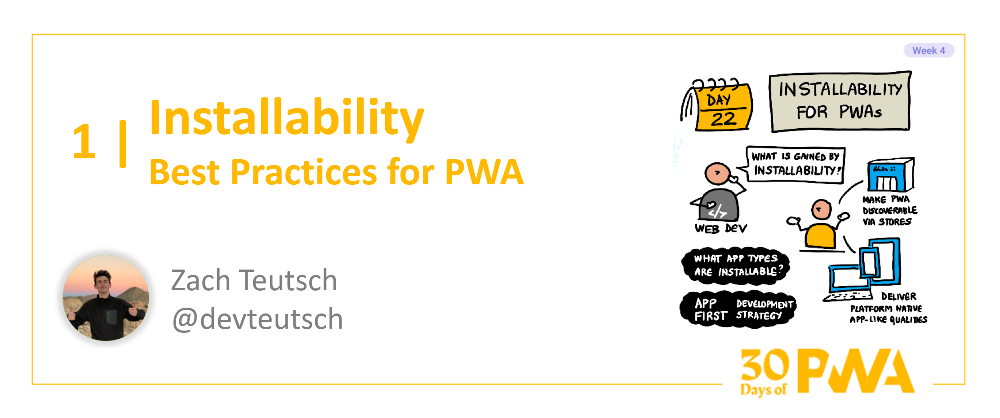
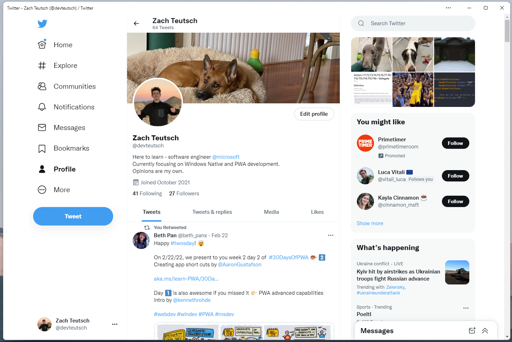

# Устанавливаемость для PWA

Добро пожаловать на четвертую неделю, первый день серии [30 Days of PWA](https://aka.ms/learn-pwa/30Days-blog)! Теперь, когда мы увидели, как [начать строить PWA](../core-concepts/index.md) и какие базовые и [расширенные возможности](../advanced-capabilities/index.md) они предоставляют, пришло время разобраться в том, как на самом деле выглядит _хороший_ PWA и как мы можем превратить наши PWA в качественные приложения. Четвертая неделя посвящена лучшим практикам и технологиям, которые можно использовать для улучшения качества PWA.

## Краткое примечание

Эта статья посвящена лучшим практикам установки и тому, когда добавление установки имеет смысл для веб-приложения. Если вы ищете основы того, как добавить установку в PWA, ознакомьтесь со статьей [Core Concepts article on Installation](../core-concepts/03.md) из первой недели.

## Вы не устанавливаете веб-сайты, вы устанавливаете приложения

Одним из наиболее важных моментов в установке PWA является понимание того, что PWA — это **приложения в первую очередь**, а веб-сайты — во вторую. Когда пользователь устанавливает приложение на устройство, он ожидает от него определенных стандартов использования и дизайна, которые он привык видеть на любой платформе. PWA — это не просто устанавливаемые веб-сайты, это функциональные и интегрированные приложения, которые соответствуют ожиданиям платформы.

## Ну и что? Приложения, веб-сайты, какая разница?

Восприятие PWA как приложения, а не как веб-сайта, устанавливает иные стандарты разработки продукта. Кроме того, это заставляет разработчика задуматься о том, имеет ли его продукт смысл в качестве PWA. Приложение, которое будет устанавливаться, должно иметь смысл в контексте платформы, и если это не так, то, возможно, его лучше использовать в качестве веб-сайта.

Вот несколько вопросов, которые можно задать при планировании разработки PWA:

-   Что получит пользователь от установки этого приложения?
-   Имеет ли мое приложение потенциал для интеграции с операционной системой?
-   Есть ли у моего приложения мотивация к регулярному использованию и повторному вовлечению?
-   Как мое приложение будет вести себя в автономных условиях?
-   Соответствует ли внешний вид и функциональность моего приложения сопоставимому опыту, характерному для конкретной платформы?

Возможно, не обязательно применять все эти вопросы к своему приложению, но это отличная отправная точка для размышлений о том, какие типы приложений вообще следует устанавливать в качестве PWA.

Представьте, что ваше приложение установлено и находится на главном экране или панели задач. Имеет ли оно там смысл?

## Тогда покажите нам хороший PWA

Существует множество отличных PWA, но [Twitter](https://aka.ms/learn-pwa/30days-4.1/twitter.com) — это отличный пример известной платформы, которая создала действительно качественный PWA для своих пользователей. PWA Twitter использует многие из доступных веб-возможностей для создания интегрированного приложения.

Некоторые моменты, которые мне нравятся в PWA Twitter:

**Плавный, похожий на приложение пользовательский опыт**

PWA Twitter не демонстрирует многих особенностей поведения, присущих типичным веб-сайтам:

-   Он использует `standalone` [режим отображения](../advanced-capabilities/04.md) для представления окна в виде приложения.
-   Окно никогда не обновляется, пользовательская оболочка всегда видна, а при взаимодействии с пользователем изменяется только область основного содержимого.
-   Задержка при навигации очень мала. Загрузка найденного содержимого (например, самих твитов) может занять секунду, но сама интерактивность пользовательского интерфейса происходит практически мгновенно.

Более подробно о лучших практиках для PWA UI/UX мы узнаем в [День 7](07.md) недели платформ и практик.

**Согласованное поведение в автономном режиме**

Несмотря на то, что Twitter в значительной степени зависит от подключения, при потере связи он сохраняет максимум взаимодействия с приложением (как и любое приложение, ориентированное на конкретную платформу).

При потере соединения приложение продолжает загружать свой вид, а пользовательский интерфейс остается доступным для навигации. Если есть твиты, сохраненные локально, они будут отображены. В противном случае пользователь получит уведомление, которое не будет мешать остальной части пользовательского интерфейса:

Мы уже немного узнали о поведении в автономном режиме в [Day 5](../core-concepts/05.md) недели 1, и еще больше мы узнаем в [reliability article](04.md) в конце этой недели.

**Интеграция с ОС и множество веб-возможностей**

Twitter также отлично использует имеющиеся веб-возможности для интеграции с вашим устройством. Вот лишь некоторые из них:

-   Push-уведомления
-   Совместный доступ из Twitter
-   Передача данных в Twitter
-   Бейджинг
-   Ярлыки

О том, как использовать все эти и другие возможности, мы уже рассказывали в [Неделя 2: Расширенные возможности](../advanced-capabilities/index.md). Ознакомьтесь с ними!

**Опубликовано в Microsoft Store**

Twitter использует одно из лучших преимуществ PWA: возможность обнаружения и установки в Интернете и в магазинах приложений.

Тот же PWA, который можно установить из браузера, может распространяться в магазинах приложений. Подробнее об упаковке для магазинов вы можете узнать из нашей [статьи о PWABuilder](../dev-tools/07.md), а более подробная информация о лучших практиках распространения в различных магазинах приложений появится [позднее на этой неделе](03.md).

## Резюме

В конце концов, лучшие практики по установке PWA — это лучшие практики для PWA в целом. Когда вы предлагаете пользователю установить ваше приложение на его машину, это приложение должно соответствовать ожиданиям, предъявляемым к приложениям на данной платформе. К счастью, мы собираемся провести всю неделю, развивая то, что уже узнали о PWA, и рассматривая некоторые лучшие практики создания надежных PWA. Если вы хотите начать с нуля, посмотрите [PWA Starter](https://aka.ms/learn-pwa/30days-4.1/github.com/pwa-builder/pwa-starter) — это шаблон PWA, созданный с учетом лучших практик.

### Упражнение

Подумайте о некоторых из ваших любимых веб-приложений, которые вы используете или создали сами.

Может ли что-нибудь из них стать хорошим PWA? А может быть, и нет?

Что можно было бы получить, воспользовавшись некоторыми возможностями, которые предоставляют PWA?

### Ресурсы

-   [Обзор Microsoft PWA](https://aka.ms/learn-pwa/30days-4.1/docs.microsoft.com/en-us/microsoft-edge/progressive-web-apps-chromium)
-   [Неделя расширенных возможностей PWA](../advanced-capabilities/index.md)
