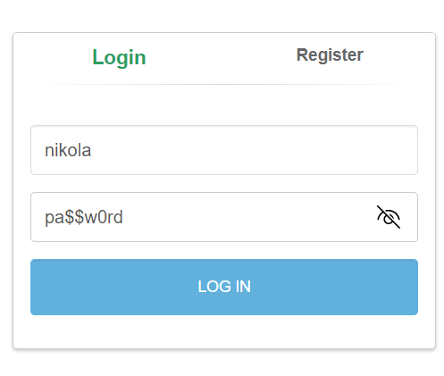
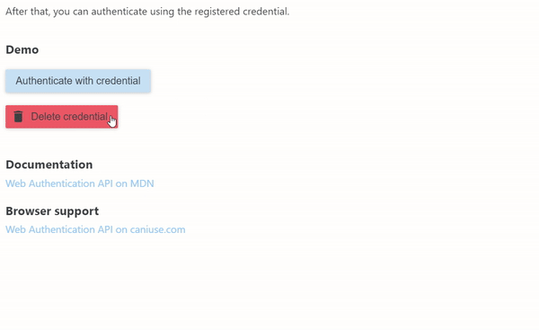

# Лучшие практики аутентификации PWA

Добро пожаловать на четвертую неделю, шестой день серии [30 Days of PWA](https://aka.ms/learn-pwa/30Days-blog)! Теперь, когда мы рассмотрели, как начать строить PWA и какие базовые и расширенные возможности они дают, пришло время погрузиться в то, как на самом деле выглядит _хороший_ PWA и как мы можем сами начать создавать качественные приложения. На четвертой неделе мы расскажем о лучших практиках и технологиях, которые можно использовать, чтобы довести PWA до совершенства.


Рано или поздно сценарии работы вашего приложения потребуют аутентификации пользователей, будь то доступ и изменение данных, перемещение данных между устройствами, создание персонализированных или общих впечатлений, а также многие (многие) другие причины, которые зависят от возможности входа пользователей в систему. В этой статье мы рассмотрим соображения, которые необходимо учитывать при принятии решения о способе аутентификации пользователей, а также некоторые лучшие практики и доступные API, которые могут помочь обеспечить безопасность пользователей при аутентификации.

## Аутентификация пользователей

Проверка личности пользователя с помощью пароля - один из самых старых методов аутентификации, широко используемых в Интернете. Большинство сайтов сегодня требуют от пользователей создания и запоминания паролей, и многие пользователи хорошо знакомы с этой концепцией. Для разработчиков пароли могут показаться самым простым выбором при добавлении аутентификации.



Однако реализовать аутентификацию, обеспечивающую хорошую безопасность и удобство для пользователей, с помощью традиционного подхода, основанного на имени пользователя и пароле, легче сказать, чем сделать. Пароли часто слабы, забыты, украдены и очень часто используются повторно. Существует множество лучших практик, которые можно применить, чтобы избежать многих распространенных проблем с паролями, например, хранить только хэши паролей, правильно шифровать сетевой трафик, применять строгие требования к паролям и т.д. Однако даже если вы все сделаете правильно, вы не сможете обойтись без человека, и для возникновения проблемы достаточно всего лишь утечки повторно используемого пароля.

Существует два основных подхода к обеспечению безопасного и простого входа в систему для пользователей. Самый простой - интегрировать федеративный вход в систему с поставщиком идентификационных данных, которому доверяют пользователи. Другой подход заключается в реализации многофакторной и/или беспарольной аутентификации. Рассмотрим, как можно приступить к реализации обоих вариантов.

## Федеративная аутентификация

Использование существующих провайдеров идентификации, таких как Microsoft, Google, Facebook и другие, позволяет повысить уровень безопасности и избежать многих проблем, связанных с реализацией собственной аутентификации на основе имени пользователя и пароля. Пользователям нужно будет помнить только один пароль, а у федеративных провайдеров идентификации имеются системы, позволяющие защитить пользователей от недобросовестных действий, обеспечить единый вход и добавить дополнительные способы проверки личности пользователей.


Федеративный вход в систему - это, пожалуй, самый простой и быстрый подход к получению авторизованного пользователя, не требующий от разработчика больших усилий, и при этом обеспечивающий безопасность пользователей.

Хотя эта модель не идеальна, она дает несколько быстрых преимуществ:

-   Пользователям не нужно запоминать новые пароли и создавать новые учетные записи.
-   Пользователи поощряются к многофакторной аутентификации. (Более того, некоторые рабочие учетные записи требуют этого).
-   Провайдеры, предоставляющие услуги по входу в систему, обеспечивают более надежную защиту от подозрительных действий, например, входа в систему из неизвестного места, свертывания недействительного пароля и т.д.
-   Вам не нужно хранить имена пользователей и пароли.

### Добавление федеративного входа в PWA

Процесс интеграции с различными провайдерами идентификационных данных несколько отличается, но концепция обычно одна и та же. Большинство из них используют [OAuth2](https://aka.ms/learn-pwa/30days-4.6/oauth.net/2) для аутентификации пользователей и запрашивают согласие на то, чтобы ваше приложение регистрировало их и предоставляло доступ к их данным. Затем вам выдается токен, который ваше приложение может использовать для идентификации пользователей и доступа к их информации. Рассмотрим два примера того, как можно быстро реализовать это в своем приложении.

#### `<pwa-auth>`

В большинстве случаев для реализации федеративной аутентификации в приложении используется библиотека аутентификации. Одним из самых простых и быстрых способов интеграции сразу с несколькими провайдерами идентификации является использование веб-компонента `<pwa-auth>`. Он строится поверх библиотек аутентификации провайдеров и "лениво" загружает их, когда это необходимо, обеспечивая при этом согласованный интерфейс для всех провайдеров.

Прежде всего, для аутентификации пользователей у любого провайдера идентификации необходимо зарегистрировать свое приложение у этого провайдера. Обычно этот процесс не вызывает затруднений, и в результате вы получаете идентификатор приложения/клиента, который можно использовать в их библиотеке или `<pwa-auth>`. Подробнее о том, как зарегистрироваться у каждого из провайдеров, поддерживаемых `<pwa-auth>`, можно узнать [здесь](https://aka.ms/learn-pwa/30days-4.6/github.com/pwa-builder/pwa-auth).

После того как вы получили идентификаторы приложений, которые хотите использовать, вы готовы к аутентификации пользователей. Давайте импортируем компонент и используем его в нашем приложении.

```html
<script
    type="module"
    src="https://cdn.jsdelivr.net/npm/@pwabuilder/pwaauth/dist/pwa-auth.js"
></script>

<!-- To create a key, see https://github.com/pwa-builder/pwa-auth#creating-keys -->
<pwa-auth
    microsoftkey="..."
    googlekey="..."
    facebookkey="..."
>
</pwa-auth>
```

Запустите свое приложение и обратите внимание, что теперь у вас есть новая красивая кнопка _Sign In_ для входа в систему с выбранным провайдером


После того как пользователь будет зарегистрирован, вы получите доступ к JWT-токену, который можно будет использовать как для идентификации пользователя на фронт-энде, так и для выполнения API-вызовов на бэкенде. Давайте получим информацию о зарегистрированном пользователе:

```js
const pwaAuth = document.querySelector('pwa-auth');
pwaAuth.addEventListener('signin-completed', (ev) => {
    const signIn = ev.detail;
    if (signIn.error) {
        console.error('Sign in failed', signIn.error);
    } else {
        console.log('Email: ', signIn.email);
        console.log('Name: ', signIn.name);
        console.log('Picture: ', signIn.imageUrl);
        console.log(
            'Provider (MS, Google, FB): ',
            signIn.provider,
        );
        console.log(
            'Raw data from provider: ',
            signIn.providerData,
        );
    }
});
```

Посмотрите на это в действии [здесь](https://aka.ms/learn-pwa/30days-4.6/pwa-auth-basic.glitch.me).

#### Управляемая идентичность через службу хостинга

Если ваше приложение размещено на одной из популярных платформ бессерверного развертывания, таких как Azure Static Web Apps, Vercel и Netlify, вы можете воспользоваться их решением управляемой идентификации для простой аутентификации пользователей на клиенте и на уровне API.

Например, Azure Static Web Apps предоставляет несколько встроенных провайдеров для авторизации в Microsoft, Twitter, Github и т.д., а также доступ к информации о пользователе через очень простой API (без необходимости регистрации приложения у провайдера или использования дополнительных библиотек).

Например, для авторизации пользователя на GitHub достаточно перенаправить его на страницу

```html
<a href="/.auth/login/github">Login</a>
```

После входа в систему они будут перенаправлены обратно в ваше приложение, и вы можете использовать простой вызов api для получения информации о вошедшем.

```js
async function getUserInfo() {
    const response = await fetch('/.auth/me');
    const payload = await response.json();
    const { clientPrincipal } = payload;
    return clientPrincipal;
}
```

Более того, все функции Azure API, входящие в состав вашего приложения, также будут иметь доступ к той же информации.

Если вы используете один из наиболее популярных хостингов, я рекомендую вам проверить, какие возможности они предлагают для аутентификации пользователей - это может оказаться самым простым способом начать работу. 😊

### Управление учетными данными и API веб-аутентификации

Наконец, в процессе аутентификации пользователей в приложениях, независимо от того, используете ли вы собственную аутентификацию на основе пароля или федеративную аутентификацию, существуют встроенные API, которые могут упростить аутентификацию для пользователей, позволяя реализовать беспарольную, двухфакторную и биометрическую аутентификацию.

API [Credential Management API](https://aka.ms/learn-pwa/30days-4.6/developer.mozilla.org/en-US/docs/Web/API/Credential_Management_API) позволяет взаимодействовать со встроенной в браузер системой паролей. С помощью этого API можно хранить и извлекать различные типы учетных данных, как традиционные (основанные на паролях), так и объединенные. Это дает пользователям такие возможности, как просмотр федеративной учетной записи, которую они использовали для входа на сайт, или возобновление сеанса без явной регистрации в истекшем сеансе. (интересный факт - веб-компонент `<pwa-auth>` использует эти API из коробки, чтобы сделать процесс входа для пользователя максимально простым).

С другой стороны, [Web Authentication API](https://aka.ms/learn-pwa/30days-4.6/developer.mozilla.org/docs/Web/API/Web_Authentication_API) (также известный как WebAuthn) обеспечивает строгую аутентификацию с использованием криптографии с открытым ключом вместо пароля. Это мощный API, позволяющий осуществлять аутентификацию без пароля и даже напрямую интегрироваться с биометрическими устройствами, такими как Windows Hello и Touch ID от Apple.



При этом генерируется пара закрытый/открытый ключ, которая используется вместо пароля для данного сайта. Закрытый ключ надежно хранится на устройстве пользователя, а открытый ключ передается серверу, который в дальнейшем может использовать его для аутентификации пользователя и проверки его личности.

Оба этих набора API позволяют облегчить многие проблемы, с которыми сталкиваются разработчики и пользователи при аутентификации пользователей. Возможно, вы не будете использовать эти API, если только начинаете работать, но вы должны знать об их существовании и по возможности использовать их в своих приложениях.

## Подведение итогов

Надеюсь, эта статья дала вам представление о некоторых аспектах аутентификации пользователей в ваших приложениях. Это лишь вершина айсберга, но, надеюсь, эта статья и приведенные ниже ресурсы помогут вам начать работу. Счастливого кодинга!

## Ресурсы

-   [Аутентификация пользователей с помощью `<pwa-auth>`](https://aka.ms/learn-pwa/30days-4.6/github.com/pwa-builder/pwa-auth)
-   [Аутентификация и авторизация для Azure Static Web Apps](https://aka.ms/learn-pwa/30days-4.6/docs.microsoft.com/azure/static-web-apps/authentication-authorization)
-   [Credential Management API](https://aka.ms/learn-pwa/30days-4.6/developer.mozilla.org/en-US/docs/Web/API/Credential_Management_API)
-   [Web Authentication API](https://aka.ms/learn-pwa/30days-4.6/developer.mozilla.org/docs/Web/API/Web_Authentication_API)
