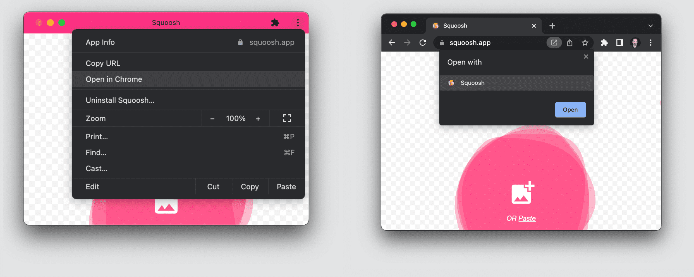
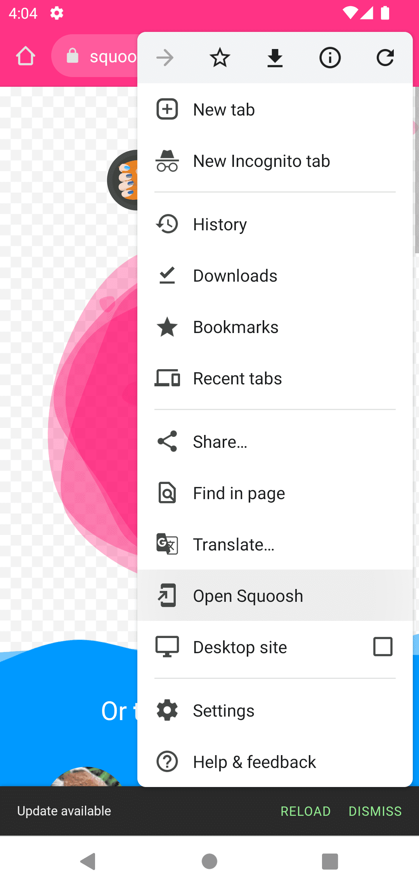

# Обнаружение

<big>Определение того, как пользователи взаимодействуют с вашим приложением, полезно для настройки и улучшения пользовательского опыта. Например, вы можете проверить, установлено ли уже ваше приложение на устройстве пользователя, и реализовать такие функции, как перенос навигации в отдельное приложение из браузера.</big>

Вы можете определить, использует ли пользователь ваш PWA в браузере или в автономном режиме. В браузерах на базе Chromium (Android и настольных) можно также обнаружить следующие события:

-   Состояние и результат диалога приглашения к установке.
-   Завершение установки.
-   Перенос навигации из браузера в окно PWA и наоборот.
-   Статус установки PWA.
-   Установка сопутствующего приложения из магазина приложений.

Эти данные можно использовать для аналитики, чтобы понять предпочтения пользователей и настроить их работу. Для перехвата этих событий можно использовать такие инструменты, как медиазапросы, события из `window` или API-возможности, которые можно найти [приведены здесь](https://developer.chrome.com/blog/fugu-status/).

## Определение режима отображения

Чтобы отследить, как пользователи запускают PWA, можно использовать `matchMedia()` для проверки медиазапроса `display-mode`.

```js
window.addEventListener('DOMContentLoaded', () => {
    let displayMode = 'browser tab';
    if (
        window.matchMedia('(display-mode: standalone)')
            .matches
    ) {
        displayMode = 'standalone';
    }
    // Log launch display mode to analytics
    console.log('DISPLAY_MODE_LAUNCH:', displayMode);
});
```

Если вы используете этот пример, не забудьте указать режим отображения из манифеста вашего веб-приложения, например, `standalone`, `minimal-ui` или `fullscreen`. В строке медиазапроса можно также сопоставить несколько запросов, используя условия, разделенные запятыми.

Кроме того, в манифест можно добавить параметр запроса `start_url`, который можно перехватить с помощью аналитики для отслеживания статистики того, когда, каким образом и как часто используется ваш PWA.

!!!warning ""

    Если вы используете параметр запроса `start_url` для сбора метрик, не забудьте задать поле `id` в манифесте для уникальной идентификации вашего приложения. О том, как настроить это поле, читайте в статье [Уникальная идентификация PWA с помощью свойства id манифеста веб-приложений](https://developer.chrome.com/blog/pwa-manifest-id/)

## Установка приложения

Когда пользователь принимает приглашение на установку в браузере, в браузерах на базе Chromium срабатывает событие `appinstalled`. Этот обработчик события может быть использован для удаления всех добавленных вами подсказок по установке приложения.

```js
window.addEventListener('appinstalled', () => {
    // If visible, hide the install promotion
    hideInAppInstallPromotion();
    // Log install to analytics
    console.log('INSTALL: Success');
});
```

Помните, что на Android-устройствах с WebAPK событие срабатывает, когда пользователь принимает диалог, а не после того, как WebAPK отчеканен и установлен. Может возникнуть задержка в несколько секунд, прежде чем приложение будет полностью установлено.

В главе [Installation Prompt chapter](installation-prompt.md) объясняется, как определить наличие приглашения к установке и какой выбор делает пользователь.

!!!warning ""

    Событие `appinstalled` доступно только в браузерах на базе Chromium, и оно является частью [incubator for the manifest spec](https://wicg.github.io/manifest-incubations/#onappinstalled-attribute)

## Передача сеанса

Пользователи могут использовать ваш PWA как внутри браузера, так и в установленном автономном виде. В настольных браузерах текущую навигацию между этими контекстами можно передавать с помощью значков или пунктов меню, как показано на следующем изображении.



На Android существует пункт меню из браузера, аналогичный тому, что есть на настольном компьютере, который переносит навигацию в приложение. В этом случае открывается текущий URL-адрес, но в приложении это будет навигация по новой странице.

На следующем изображении показан пункт меню в Android, когда приложение уже установлено.



### Перенос после установки

В браузерах настольных компьютеров текущая навигация сразу же переносится в приложение при установке. Вкладка браузера закрывается, и открывается только что установленное приложение, продолжая работу пользователя.

В мобильных браузерах при установке приложения текущая навигация остается в браузере. Если пользователь хочет перейти к приложению, ему необходимо открыть его вручную, и это будет новая навигация.

### Обнаружение переноса

Для обнаружения перехода между браузером и окном можно использовать медиазапрос:

```js
window.addEventListener('DOMContentLoaded', () => {
    // replace standalone with your display used in manifest
    window
        .matchMedia('(display-mode: standalone)')
        .addListener((event) => {
            if (event.matches) {
                // From browser to standalone
            } else {
                // From standalone to browser
            }
        });
});
```

### Изоляция хранилища в iOS и iPadOS

На iOS и iPadOS между браузером и установленной иконкой нет навигации и передачи URL. Даже если это один и тот же PWA, каждый установленный пользователем значок PWA будет иметь собственное хранилище, изолированное от вкладки Safari и других значков. Когда пользователь открывает установленный значок, хранилище не передается Safari. Если PWA требует входа в систему, пользователю придется войти в систему еще раз. Если приложение было добавлено на главный экран несколько раз, то для каждого экземпляра PWA у пользователя будет своя сессия.

## Связанные приложения

<p class="ciu_embed" data-feature="mdn-html__manifest__related_applications" data-periods="future_1,current,past_1,past_2" data-accessible-colours="false"></p>

Сайт указывает на связь с приложением через манифест. Для этого используется член [`related_applications`](https://developer.mozilla.org/docs/Web/Manifest/related_applications) спецификации Web App Manifest. Ключ `related_applications` — это массив объектов, представляющих каждое связанное приложение. Каждая запись содержит `платформу`, `url` и необязательный `id`.

Вот возможные [значения платформы](https://github.com/w3c/manifest/wiki/Platforms):

-   `play`: приложения Google Play (Android и ChromeOS).
-   `itunes`: Apple App Store (macOS, iOS и iPadOS).
-   `windows`: Microsoft Store (Windows 10 и 11).
-   `amazon`: Amazon AppStore (FireOS).
-   `webapp`: установленное PWA.

### Предложите связанное приложение

Когда пользователь устанавливает приложение, вы можете перенаправить его на связанное приложение, если установите в манифесте поле `prefer_related_applications` в значение `true`. При такой настройке на совместимых браузерах потоки установки не будут устанавливать PWA, а будут запускать установку магазина с `url` или `id`, указанных в поле `related_applications`.

Связанное приложение может быть вашим PWA, и оно будет установлено через магазин приложений. Одним из преимуществ такой конфигурации является то, что в настоящее время только приложения, установленные через магазин приложений, восстанавливаются при резервном копировании или при переходе на новое устройство.

```json
{
    ..."related_applications:"[
        {
            "platform": "play",
            "url": "https://play.google.com/..."
        }
    ],
    "prefer_related_applications": true
}
```

!!!note ""

    Использование `prefer_related_applications: true` только с предпочтительным приложением `webapp` никак не влияет на то, как будет предлагаться и устанавливаться ваш PWA.

#### Баннеры Apple Smart App.

Safari не поддерживает член `related_applications`, но предлагает [Smart App Banners](https://developer.apple.com/documentation/webkit/promoting_apps_with_smart_app_banners) для приложений в App Store. Поэтому, если вы хотите продвинуть PWA или другое приложение, опубликованное в App Store, вы можете включить в HTML вашего PWA метатеги, предлагающие пользователю установить приложение (см. только что приведенную ссылку), или перенести навигацию, если оно уже установлено.

### Обнаружение связанных установленных приложений

Метод [`getInstalledRelatedApps()`](https://web.dev/articles/get-installed-related-apps) позволяет вашему сайту проверить, установлено ли ваше iOS/Android/десктопное приложение или PWA на устройстве пользователя.

Проверка наличия установленного связанного приложения позволяет реализовать такие возможности, как скрытие пользовательских подсказок или перенаправление пользователя непосредственно на установленное приложение, а не на сайт общего назначения. Для использования метода `getInstalledRelatedApps()` необходимо, чтобы и установленное приложение, и веб-сайт настроили связь друг с другом. Каждое приложение, в зависимости от своей платформы, включает метаданные для распознавания сайта, а сайт включает ожидаемое установленное приложение в поле `related_applications` в манифесте.

Такие инструменты, как [BubbleWrap](https://github.com/GoogleChromeLabs/bubblewrap) или [PWA Builder](https://www.pwabuilder.com/), позволяющие публиковать PWA в магазинах приложений, уже добавляют необходимые метаданные, поэтому ваш сайт может сразу же использовать `getInstalledRelatedApps()`. Чтобы определить, установлен ли уже PWA с помощью `getInstalledRelatedApps()`, определите `webapp` в поле манифеста `related_applications` с указанием URL-адреса вашего манифеста:

```json
...
"related_applications": [{
   "platform": "webapp",
   "url": "https://example.com/manifest.json",
}],
...
```

`getInstalledRelatedApps()` возвращает массив объектов приложений. Если массив пуст, то связанное приложение не установлено.

```js
const relatedApps =
    await navigator.getInstalledRelatedApps();
const PWAisInstalled = relatedApps.length > 0;
```

#### Обнаружение установки из-за пределов области действия PWA

В Chrome на Android 89 можно обнаружить установку PWA даже из-за пределов области действия PWA. Ваш PWA должен установить JSON-файл в папке `/.well-known/`, дающий разрешение на установку из другой области видимости, как описано в [этой статье](https://web.dev/articles/get-installed-related-apps#check-pwa-out-of-scope).

## Ресурсы

-   [Установлено ли ваше приложение? getInstalledRelatedApps() подскажет вам!](https://web.dev/articles/get-installed-related-apps)
-   [MDN: Связанные приложения](https://developer.mozilla.org/docs/Web/Manifest/related_applications)
-   [MDN: Событие AppInstalled](https://developer.mozilla.org/docs/Web/API/Window/appinstalled_event)
-   [Apple: Продвижение приложений с помощью баннеров Smart App Banners](https://developer.apple.com/documentation/webkit/promoting_apps_with_smart_app_banners)

:material-information-outline: Источник &mdash; [Detection](https://web.dev/learn/pwa/detection)
