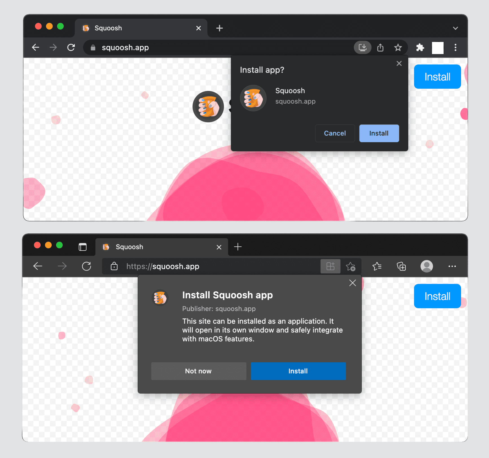
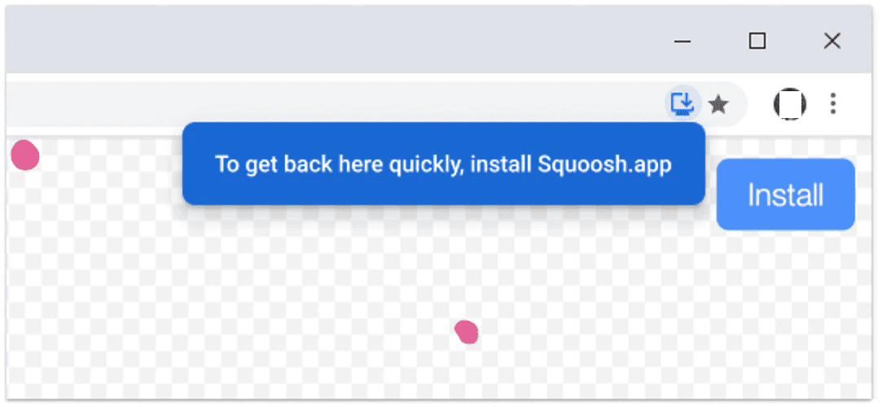
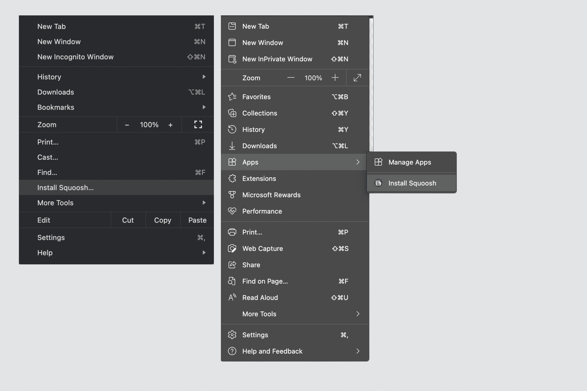
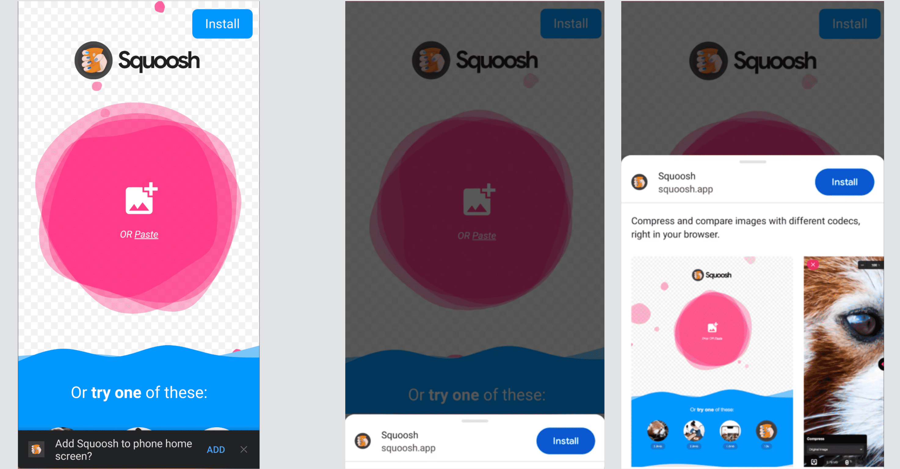
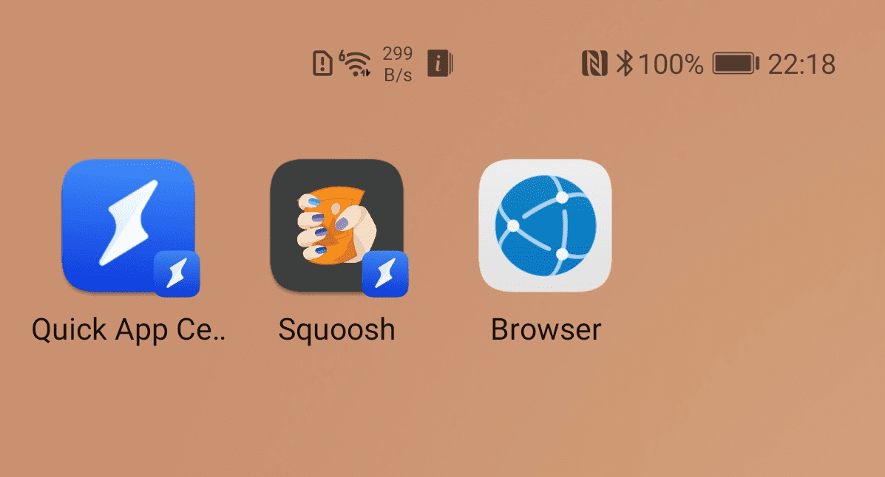
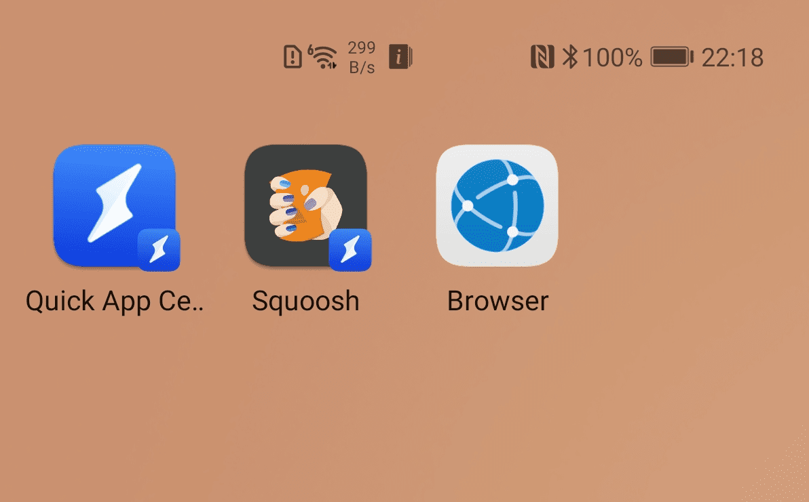

# Установка

<big>Установленные приложения легко доступны и могут использовать преимущества некоторых более глубоких интеграций с ОС. Узнайте, как сделать PWA устанавливаемым и получить эти преимущества.</big>

После того как пользователь установит ваш PWA, он будет:

-   Иметь значок в пусковой установке, на главном экране, в меню "Пуск" или на панели запуска.
-   Появляться в результате поиска приложения на устройстве.
-   Отдельное окно в операционной системе.
-   Поддержка определенных возможностей.

!!!note ""

    Хотя установка отличается в зависимости от браузера и операционной системы, для установки PWA из браузера не нужно создавать какой-либо пакет или исполняемый файл.

## Критерии установки

Каждый браузер имеет критерий, который определяет, когда сайт или веб-приложение является Progressive Web App и может быть установлен для автономной работы. Метаданные для вашего PWA задаются файлом на основе JSON, известным как Web App Manifest, который мы подробно рассмотрим в [следующем модуле](web-app-manifest.md).

В качестве минимального требования к возможности установки большинство браузеров, которые ее поддерживают, используют файл Web App Manifest и определенные свойства, такие как имя приложения и конфигурация устанавливаемого опыта. Исключением является Safari для macOS, который не поддерживает возможность установки.

Требования к возможности установки для разных браузеров отличаются, [эта статья](https://web.dev/articles/install-criteria) подробно описывает критерии для Google Chrome и содержит ссылки на требования для других браузеров.

Поскольку проверка соответствия PWA требованиям к возможности установки может занимать несколько секунд, сама возможность установки может быть недоступна сразу после получения ответа URLs.

!!!note ""

    Процесс удаления PWA отличается для каждой комбинации операционной системы и браузера. В большинстве случаев приложение может быть удалено так же, как и любое другое приложение для конкретной платформы; в других случаях в окне PWA появляется меню с опцией удаления. Удаление значка может не очистить хранилище, используемое PWA.

### Установка на рабочем столе

В настоящее время установка PWA на настольные компьютеры поддерживается браузерами Google Chrome и Microsoft Edge на платформах Linux, Windows, macOS и Chromebooks. В этих браузерах в строке URL отображается значок (иконка) установки (см. рисунок ниже), указывающий на то, что текущий сайт можно установить.



Когда пользователь работает с сайтом, он может увидеть всплывающее окно, подобное приведенному ниже, с предложением установить его в качестве приложения.



В выпадающем меню браузера также имеется пункт `"Установить <имя приложения>"`, которым может воспользоваться пользователь:



!!!note ""

    Браузеры на базе Chromium на настольных компьютерах позволяют увидеть все установленные PWA в этом браузере с помощью функции `about:apps`.

На настольных операционных системах поддерживаются только автономный и минимальный [режимы отображения](app-design.md#display-modes).

PWA, установленные на настольных компьютерах:

-   Имеют значок в меню "Пуск" или на экране "Пуск" на ПК с ОС Windows, в доке или на рабочем столе в графических интерфейсах Linux, в панели запуска macOS или в программе запуска приложений на Chromebook.
-   Иметь значок в переключателях приложений и доках, когда приложение активно, недавно использовалось или открыто в фоновом режиме.
-   Появляться в поиске приложений, например, в поиске в Windows или Spotlight в macOS.
-   Могут устанавливать на своих значках номер значка, обозначающего новые уведомления. Для этого используется [Badging API](https://developer.mozilla.org/docs/Web/API/Badging_API).
-   Можно установить контекстное меню для значка с помощью [App Shortcuts](https://developer.mozilla.org/docs/Web/Manifest/shortcuts).
-   Не может быть установлено дважды в один и тот же браузер.

!!!note ""

    При установке могут быть открыты другие возможности, недоступные для PWA, работающих на вкладке браузера. Подробнее об этом мы поговорим в главе [Capabilities Chapter](capabilities.md).

После установки приложения на рабочий стол пользователи могут перейти в раздел `about:apps`, щелкнуть правой кнопкой мыши на PWA и выбрать "Start App when you Sign In", если они хотят, чтобы приложение открывалось автоматически при запуске.

### Установка на iOS и iPadOS

Предложение браузера установить PWA не выходит на iOS и iPadOS. На этих платформах PWA также известны как _веб-приложения для домашнего экрана_. Эти приложения должны быть добавлены на домашний экран вручную через меню, доступное только в Safari. Рекомендуется добавить в html тег [`apple-touch-icon`](https://developer.chrome.com/docs/lighthouse/pwa/apple-touch-icon/). Чтобы определить иконку, включите путь к ней в раздел HTML `<head>`, например, так:

```html
<link rel="apple-touch-icon" href="/icons/ios.png" />
```

Safari использует эту информацию для создания ярлыка, и если вы не предоставите специальный значок для устройств Apple, то значок на главном экране будет представлять собой скриншот вашего PWA, когда пользователь его установил.

Важно понимать, что установка PWA возможна только в том случае, если пользователь просматривает ваш сайт из Safari. Другие браузеры, доступные в App Store, такие как Google Chrome, Firefox, Opera или Microsoft Edge, не могут установить PWA на главный экран.

Добавление приложений на главный экран осуществляется следующим образом:

1.  Откройте меню "Поделиться", доступное в нижней или верхней части браузера.
2.  Нажмите **Добавить на главный экран**.
3.  Подтвердите название приложения; название может быть изменено пользователем.
4.  Нажмите **Добавить**. На iOS и iPadOS закладки на веб-сайты и PWA выглядят на главном экране одинаково.

<video controls autoplay>
<source src="/learn/pwa/installation-4.mp4" />
</video>

На iOS и iPadOS поддерживается только автономный режим [display mode](app-design.md). Поэтому при использовании режима минимального пользовательского интерфейса произойдет возврат к ярлыку браузера, а при использовании полноэкранного — к автономному режиму.

!!!warning ""

    На устройствах Apple можно устанавливать один и тот же PWA несколько раз; каждая установка будет иметь собственное изолированное хранилище и будет рассматриваться как отдельное приложение.

PWA, установленные на iOS и iPadOS:

-   Появляются на главном экране, в поиске Spotlight, Siri Suggestions и в поиске App Library.
-   Не отображаются в папках категорий App Gallery.
-   Отсутствует поддержка таких возможностей, как бейджинг и ярлыки приложений.

Кстати, для создания иконок PWA в операционной системе Safari используется собственная технология, известная как [Web Clips](https://developer.apple.com/documentation/devicemanagement/webclip). Они представляют собой XML-файлы в формате Apple Property List, хранящиеся в файловой системе.

!!!warning ""

    Когда пользователи используют PWA, они используют не экземпляр приложения Safari (как в случае с Chrome), а нечто, известное как _Web.app_, поэтому следует ожидать небольших различий между PWA, отображаемым в Safari и в окне PWA. И Safari, и Web.app используют одно и то же ядро WebKit и одну и ту же среду выполнения JavaScript, но они работают в разных процессах и могут иметь разные реализации, например, изолированное хранилище.

### Установка на Android

На Android подсказки по установке PWA зависят от устройства и браузера. Пользователи могут видеть:

-   Различия в формулировках пунктов меню установки, таких как **Установить** или **Добавить на главный экран**.
-   Подробные диалоги установки.

На следующем изображении показаны два варианта диалогового окна установки: простой мини-инфобар (слева) и подробное окно установки (справа).



В зависимости от устройства и браузера ваш PWA будет установлен либо как WebAPK, либо как ярлык, либо как QuickApp.

#### WebAPK

WebAPK — это пакет для Android (APK), созданный доверенным поставщиком для устройства пользователя, обычно в облаке, на сервере WebAPK _minting server_. Этот метод используется в браузере Google Chrome на устройствах с установленными Google Mobile Services (GMS), а также в интернет-браузере Samsung, но только на устройствах производства Samsung, таких как телефон или планшет Galaxy. В совокупности это составляет большинство пользователей Android.

Когда пользователь устанавливает PWA из Google Chrome и при этом используется WebAPK, майнинг-сервер "майнит" (упаковывает) и подписывает APK для PWA. Этот процесс занимает некоторое время, но когда APK готов, браузер бесшумно устанавливает это приложение на устройство пользователя. Поскольку APK подписан доверенными поставщиками (Play Services или Samsung), телефон устанавливает его без отключения системы безопасности, как и любое приложение из магазина. При этом нет необходимости в боковой загрузке приложения.

PWA, устанавливаемые через WebAPK:

-   Имеют значок в программе запуска приложений и на главном экране.
-   Появляются в разделе "Настройки", "Приложения".
-   Могут иметь несколько возможностей, таких как [бейджинг](https://developer.chrome.com/articles/badging-api/), [ярлыки приложений](https://web.dev/articles/app-shortcuts) и [захват ссылок в ОС](https://developer.chrome.com/docs/web-platform/declarative-link-capturing/).
-   Может [обновлять](https://web.dev/articles/manifest-updates) значок и метаданные приложения.
-   Не может быть установлено дважды.

!!!note ""

    При использовании WebAPK вам, как разработчику PWA, не нужно собирать или подписывать какой-либо пакет. Все происходит прозрачно между браузером, устройством и майнинг-сервером.

#### Ярлыки

Хотя WebAPK обеспечивают наилучшие возможности для пользователей Android, их не всегда можно создать. Когда это не удается, браузеры прибегают к созданию ярлыка сайта. Поскольку Firefox, Microsoft Edge, Opera, Brave и Samsung Internet (на устройствах без Samsung) не имеют майнинговых серверов, которым они доверяют, они будут создавать ярлыки. Если майнинг-сервис недоступен или PWA не соответствует требованиям к установке, Google Chrome тоже будет создавать ярлыки.

PWA, установленные с помощью ярлыков:

-   Имеют значок в виде браузера на главном экране (см. следующие примеры).
-   Не имеют значка в лаунчере или на странице **Настройки, Приложения**.
-   Не могут использовать возможности, требующие установки.
-   Не могут обновлять свои значки и метаданные приложений.
-   Могут быть установлены многократно, даже с использованием одного и того же браузера; при этом все они будут указывать на один и тот же экземпляр и использовать одно и то же хранилище.



#### QuickApps

Некоторые производители, в том числе Huawei и ZTE, предлагают платформу [QuickApps](https://developer.huawei.com/consumer/en/huawei-quickApp/) для создания легких веб-приложений, похожих на PWA, но использующих другой технологический стек. Некоторые браузеры на этих устройствах, например браузер Huawei, могут устанавливать PWA, упакованные как QuickApp, даже если вы не используете стек QuickApp.

Когда PWA устанавливается как QuickApp, пользователи получают опыт, аналогичный тому, который они имеют при использовании ярлыков, но с иконкой, помеченной значком QuickApps (изображение молнии). Приложение также будет доступно для запуска из QuickApp Center.



## Запрос на установку

В браузерах на базе Chromium на настольных компьютерах и устройствах Android можно вызвать диалог установки браузера из вашего PWA. В главе [Installation Prompt chapter](installation-prompt.md) будут рассмотрены [patterns for doing so](https://web.dev/articles/promote-install) и способы их реализации.

!!!warning ""

    Если вы предоставляете пользователю инструкции, помните, что названия пунктов меню зависят от языка.

## Каталоги приложений и магазины

Ваш PWA может быть размещен в каталогах приложений и магазинах, что позволит пользователям найти его там же, где они находят другие приложения. Большинство каталогов приложений и магазинов поддерживают технологии, позволяющие публиковать пакет, не включающий в себя все веб-приложение (например, HTML и ресурсы). Эти технологии позволяют создать только пусковую установку для отдельного движка веб-рендеринга, который будет загружать приложение и позволять сервису-воркеру кэшировать необходимые ресурсы.

К каталогам и магазинам приложений, поддерживающим публикацию PWA, относятся:

-   [Google Play Store для Android и ChromeOS](https://chromeos.dev/en/publish/pwa-in-play), с использованием [Trusted Web Activity](https://developer.chrome.com/docs/android/trusted-web-activity/).
-   Apple App Store для iOS, macOS и iPadOS, использующий WKWebView и [App-Bound Domains](https://webkit.org/blog/10882/app-bound-domains/).
-   [Microsoft Store для Windows 10 и 11](https://docs.microsoft.com/en-us/windows/uwp/publish/pwa/overview), с использованием пакетов APPX.
-   [Samsung Galaxy Store](https://samsunginternet.github.io/introducing-progressive-web-apps-to-samsung-galaxy-store/), с использованием майнинг-сервера Samsung WebAPK.
-   Huawei AppGallery, с использованием контейнера [QuickApp для вашего HTML-приложения](https://developer.huawei.com/consumer/en/doc/development/quickApp-Guides/quickapp-h5-to-quickapp-introduction-0000001150075595).

Если вы хотите узнать больше о том, как опубликовать PWA в каталогах приложений и магазинах, ознакомьтесь с [BubbleWrap CLI](https://github.com/GoogleChromeLabs/bubblewrap) и [PWA Builder](https://pwabuilder.com).

!!!warning ""

    Некоторые каталоги приложений и магазины имеют технические или бизнес-требования, которые необходимо соблюдать до того, как ваш PWA будет принят к публикации. Перед началом работы ознакомьтесь с требованиями каждого магазина.

## Ресурсы

-   [Что нужно для установки](https://web.dev/articles/install-criteria)
-   [WebAPKs на Android](https://web.dev/articles/webapks)
-   [Паттерны для продвижения установки PWA](https://web.dev/articles/promote-install)
-   [Использование PWA в приложении для Android](https://web.dev/articles/using-a-pwa-in-your-android-app)
-   [Размещение своего Progressive Web App в Google Play](https://chromeos.dev/en/publish/pwa-in-play)
-   [Представление PWA в Microsoft Store](https://docs.microsoft.com/en-us/windows/uwp/publish/pwa/overview)
-   [Публикация PWA в App Store](https://firt.dev/pwa-stores/)
-   [WebKit: App-Bound Domains](https://webkit.org/blog/10882/app-bound-domains/)

:material-information-outline: Источник &mdash; [Installation](https://web.dev/learn/pwa/installation)
