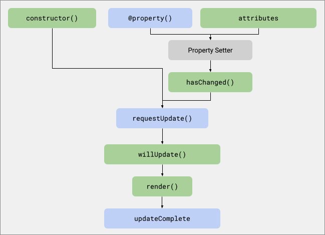

# Жизненный цикл

Компоненты Lit используют стандартные методы жизненного цикла пользовательских элементов. Кроме того, Lit вводит цикл реактивного обновления, который отображает изменения в DOM при изменении реактивных свойств.

## Стандартный жизненный цикл пользовательского элемента { #custom-element-lifecycle }

Компоненты Lit являются стандартными пользовательскими элементами и наследуют методы жизненного цикла пользовательских элементов. Информацию о жизненном цикле пользовательских элементов см. в [Using the lifecycle callbacks](https://developer.mozilla.org/en-US/docs/Web/Web_Components/Using_custom_elements#using_the_lifecycle_callbacks) на MDN.

!!!info ""

    Если вам нужно настроить какой-либо из стандартных методов жизненного цикла пользовательского элемента, обязательно вызывайте реализацию `super` (например, `super.connectedCallback()`), чтобы сохранить стандартную функциональность Lit.

### `constructor()` {#constructor}

Вызывается при создании элемента. Также он вызывается при обновлении существующего элемента, что происходит, когда определение пользовательского элемента загружается после того, как элемент уже находится в DOM.

**Lit поведение**

Запрашивает асинхронное обновление с помощью метода `requestUpdate()`, поэтому, когда компонент Lit обновляется, он немедленно выполняет обновление.

Сохраняет все свойства, уже установленные для элемента. Это гарантирует, что значения, установленные до обновления, будут сохранены и корректно отменят значения по умолчанию, установленные компонентом.

**Примеры использования**

Выполнение одноразовых задач инициализации, которые должны быть выполнены до первого [обновления](#reactive-update-cycle). Например, если не используются декораторы, значения по умолчанию для свойств могут быть установлены в конструкторе, как показано в [Объявление свойств в статическом поле свойств](properties.md#declaring-properties-in-a-static-properties-field).

```js
constructor() {
  super();
  this.foo = 'foo';
  this.bar = 'bar';
}
```

### `connectedCallback()` {#connectedcallback}

Вызывается, когда компонент добавляется в DOM документа.

**Поведение Lit**

Lit инициирует первый цикл обновления элемента после его подключения. В процессе подготовки к рендерингу Lit также обеспечивает создание `renderRoot` (как правило, его `shadowRoot`).

После того как элемент хотя бы раз подключился к документу, обновления компонента будут происходить независимо от состояния подключения элемента.

**Примеры использования**

В `connectedCallback()` необходимо настроить задачи, которые должны выполняться только при подключении элемента к документу. Наиболее распространенным из них является добавление слушателей событий во внешние по отношению к элементу узлы, например, обработчик события нажатия клавиши, добавленный в окно. Как правило, все, что делается в `connectedCallback()`, должно быть отменено при отключении элемента — например, удаление слушателей событий на окне для предотвращения утечки памяти.

```js
connectedCallback() {
  super.connectedCallback()
  addEventListener('keydown', this._handleKeydown);
}
```

### `disconnectedCallback()` {#disconnectedcallback}

Вызывается, когда компонент удаляется из DOM документа.

**Поведение Lit**

Приостанавливает [реактивный цикл обновления](#reactive-update-cycle). Он возобновляется при подключении элемента.

**Варианты использования**

Этот обратный вызов является основным сигналом для элемента о том, что он больше не может использоваться; поэтому `disconnectedCallback()` должен гарантировать, что ничто не удерживает ссылку на элемент (например, слушатели событий, добавленные в узлы, внешние по отношению к элементу), чтобы он был свободен для сборки мусора. Поскольку элементы могут быть вновь подключены после отключения, как в случае перемещения элемента в DOM или кэширования, любые такие ссылки или слушатели могут быть восстановлены через `connectedCallback()`, чтобы элемент продолжал работать так, как ожидается в этих сценариях. Например, удалите слушателей событий для внешних по отношению к элементу узлов, например обработчик события нажатия клавиши, добавленный в окно.

```js
disconnectedCallback() {
  super.disconnectedCallback()
  window.removeEventListener('keydown', this._handleKeydown);
}
```

!!!warning "Не нужно удалять внутренние слушатели событий"

    Вам не нужно удалять слушатели событий, добавленные в DOM самого компонента, включая те, которые были добавлены декларативно в вашем шаблоне. В отличие от внешних слушателей событий, они не будут препятствовать сборке компонента.

### `attributeChangedCallback()` { #attributechangedcallback }

Вызывается при изменении одного из `observedAttributes` элемента.

**Поведение Lit**

Lit использует этот обратный вызов для синхронизации изменений атрибутов с реактивными свойствами. В частности, когда атрибут установлен, устанавливается и соответствующее свойство. Lit также автоматически настраивает массив `observedAttributes` элемента в соответствии со списком реактивных свойств компонента.

**Варианты использования**

Вам редко понадобится реализовывать этот обратный вызов.

### `adoptedCallback()` {#adoptedcallback}

Вызывается при перемещении компонента в новый документ.

!!!info ""

    Имейте в виду, что `adoptedCallback` не является полифункциональным.

**Поведение Lit**

У Lit нет поведения по умолчанию для этого обратного вызова.

**Варианты использования**

Этот обратный вызов следует использовать только в продвинутых случаях, когда поведение элемента должно меняться при смене документов.

## Реактивный цикл обновления {#reactive-update-cycle}

В дополнение к стандартному жизненному циклу пользовательских элементов компоненты Lit также реализуют цикл реактивного обновления.

Реактивный цикл обновления запускается при изменении реактивного свойства или при явном вызове метода `requestUpdate()`. Lit выполняет обновления асинхронно, поэтому изменения свойств происходят пакетно — если после запроса обновления, но до начала обновления, изменяется больше свойств, все изменения попадают в одно обновление.

Обновления происходят по времени микрозадачи, что означает, что они происходят до того, как браузер нарисует следующий кадр на экране. Более подробную информацию о тайминге браузера см. в статье [Jake Archibald's article](https://jakearchibald.com/2015/tasks-microtasks-queues-and-schedules/) о микрозадачах.

На высоком уровне цикл реактивного обновления выглядит следующим образом:

1.  Обновление планируется при изменении одного или нескольких свойств или при вызове `requestUpdate()`.
2.  Обновление выполняется до того, как будет нарисован следующий кадр.
    1.  Устанавливаются отражающие атрибуты.
    2.  Вызывается метод рендеринга компонента для обновления его внутреннего DOM.
3.  Обновление завершается, и обещание `updateComplete` разрешается.

Более подробно это выглядит следующим образом:

**Pre-Update**


**Update**


**Post-Update**


### Карта `changedProperties` {#changed-properties}

Многие реактивные методы обновления получают `Map` измененных свойств. Ключи `Map` — это имена свойств, а значения — это **предыдущие** значения свойств. Вы всегда можете найти текущие значения свойств, используя `this.property` или `this[property]`.

#### Типы TypeScript для `changedProperties`

Если вы используете TypeScript и вам нужна строгая проверка типов для карты `changedProperties`, вы можете использовать `PropertyValues<this>`, которая выводит правильный тип для каждого имени свойства.

```ts
import {LitElement, html, PropertyValues} from 'lit';
// ...
  shouldUpdate(changedProperties: PropertyValues<this>) {
    // ...
  }
```

Если вы менее озабочены строгой типизацией или проверяете только имена свойств, а не их предыдущие значения, вы можете использовать менее строгий тип, например `Map<string, any>`.

Обратите внимание, что `PropertyValues<this>` не распознает свойства `protected` или `private`. Если вы проверяете какие-либо свойства `protected` или `private`, вам нужно использовать менее ограничивающий тип.

#### Изменение свойств во время обновления {#changing-properties-during-an-update}

Изменение свойства _во время_ обновления (вплоть до метода `render()`) обновляет карту `changedProperties`, но **не** вызывает нового обновления. Изменение свойства _после_ `render()` (например, в методе `updated()`) запускает новый цикл обновления, и измененное свойство добавляется в новую карту `changedProperties`, которая будет использоваться в следующем цикле.

### Запуск обновления {#reactive-update-cycle-triggering}

Обновление запускается при изменении реактивного свойства или вызове метода `requestUpdate()`. Поскольку обновления выполняются асинхронно, все изменения, которые происходят до выполнения обновления, приводят только к **одному обновлению**.

#### `hasChanged()` {#haschanged}

Вызывается при установке реактивного свойства. По умолчанию `hasChanged()` выполняет строгую проверку на равенство и, если возвращает `true`, назначается обновление. Дополнительную информацию см. в разделе [Настройка `hasChanged()`](properties.md#haschanged).

#### `requestUpdate()` {#requestUpdate}

Вызовите `requestUpdate()`, чтобы запланировать явное обновление. Это может быть полезно, если вам нужно, чтобы элемент обновлялся и отображался при изменении чего-либо, не связанного со свойством. Например, компонент таймера может вызывать `requestUpdate()` каждую секунду.

```js
connectedCallback() {
  super.connectedCallback();
  this._timerInterval = setInterval(() => this.requestUpdate(), 1000);
}

disconnectedCallback() {
  super.disconnectedCallback();
  clearInterval(this._timerInterval);
}
```

Список свойств, которые изменились, хранится в карте `changedProperties`, которая передается последующим методам жизненного цикла. Ключами карты являются имена свойств, а ее значениями — предыдущие значения свойств.

При желании вы можете передать имя свойства и предыдущее значение при вызове `requestUpdate()`, которые будут сохранены в карте `changedProperties`. Это может быть полезно, если вы реализуете пользовательские геттеры и сеттеры для свойства. Дополнительные сведения о реализации пользовательских геттеров и сеттеров см. в [Reactive properties](properties.md).

```js
this.requestUpdate('state', this._previousState);
```

### Выполнение обновления {#reactive-update-cycle-performing}

Когда выполняется обновление, вызывается метод `performUpdate()`. Этот метод вызывает ряд других методов жизненного цикла.

Любые изменения, которые обычно вызывают обновление и происходят **пока** компонент обновляется, **не планируют новое обновление**. Это делается для того, чтобы значения свойств могли быть вычислены в процессе обновления. Свойства, измененные во время обновления, **отражаются в карте `changedProperties`**, так что последующие методы жизненного цикла могут действовать в соответствии с изменениями.

#### `shouldUpdate()` {#shouldupdate}

Вызывается, чтобы определить, требуется ли цикл обновления.

|  |  |
| --- | --- |
| Аргументы | `changedProperties`: `Map` с ключами, которые являются именами измененных свойств, и значениями, которые являются соответствующими предыдущими значениями. |
| Обновления | Нет. Изменения свойств в этом методе не вызывают обновления элемента. |
| Вызывать супер? | Нет необходимости. |
| Вызывается на сервере? | Нет. |

Если `shouldUpdate()` возвращает `true`, что происходит по умолчанию, то обновление проходит нормально. Если она возвращает `false`, то остальная часть цикла обновления не будет вызвана, но обещание `updateComplete` все равно будет разрешено.

Вы можете реализовать `shouldUpdate()`, чтобы указать, какие изменения свойств должны вызывать обновления. Используйте карту `changedProperties` для сравнения текущих и предыдущих значений.

=== "TS"

    ```ts
    shouldUpdate(changedProperties: Map<string, any>) {
    	// Only update element if prop1 changed.
    	return changedProperties.has('prop1');
    }
    ```

=== "JS"

    ```js
    shouldUpdate(changedProperties) {
    	// Only update element if prop1 changed.
    	return changedProperties.has('prop1');
    }
    ```

#### `willUpdate()` {#willupdate}

Вызывается перед `update()` для вычисления значений, необходимых во время обновления.

|  |  |
| --- | --- |
| Аргументы | `changedProperties`: `Map` с ключами, которые являются именами измененных свойств, и значениями, которые являются соответствующими предыдущими значениями. |
| Обновляется? | Нет. Изменения свойств в этом методе не вызывают обновления элемента. |
| Вызывать super? | Нет необходимости. |
| Вызывается на сервере? | Да. |

Реализуйте `willUpdate()` для вычисления значений свойств, которые зависят от других свойств и используются в остальной части процесса обновления.

=== "TS"

    ```ts
    willUpdate(changedProperties: PropertyValues<this>) {
    	// only need to check changed properties for an expensive computation.
    	if (changedProperties.has('firstName') || changedProperties.has('lastName')) {
    		this.sha = computeSHA(`${this.firstName} ${this.lastName}`);
    	}
    }

    render() {
    	return html`SHA: ${this.sha}`;
    }
    ```

=== "JS"

    ```js
    willUpdate(changedProperties) {
    	// only need to check changed properties for an expensive computation.
    	if (changedProperties.has('firstName') || changedProperties.has('lastName')) {
    		this.sha = computeSHA(`${this.firstName} ${this.lastName}`);
    	}
    }

    render() {
    	return html`SHA: ${this.sha}`;
    }
    ```

#### `update()` {#update}

Вызывается для обновления DOM компонента.

|  |  |
| --- | --- |
| Аргументы | `changedProperties`: `Map` с ключами, которые являются именами измененных свойств, и значениями, которые являются соответствующими предыдущими значениями. |
| Обновляется? | Нет. Изменения свойств в этом методе не вызывают обновления элемента. |
| Вызывать super? | Да. Без вызова super атрибуты и шаблон элемента не будут обновляться. |
| Вызывается на сервере? | Нет. |

Отражает значения свойств в атрибутах и вызывает `render()` для обновления внутреннего DOM компонента.

Как правило, реализация этого метода не требуется.

#### `render()` {#render}

Вызывается `update()` и должен быть реализован так, чтобы возвращать рендерируемый результат (например, `TemplateResult`), используемый для рендеринга DOM компонента.

|  |  |
| --- | --- |
| Аргументы | Нет. |
| Обновления? | Нет. Изменения свойств в этом методе не вызывают обновления элемента. |
| Вызывать super? | Нет необходимости. |
| Вызывается на сервере? | Да. |

Метод `render()` не имеет аргументов, но обычно он ссылается на свойства компонентов. Дополнительную информацию см. в [Rendering](rendering.md).

```js
render() {
  const header = `<header>${this.header}</header>`;
  const content = `<section>${this.content}</section>`;
  return html`${header}${content}`;
}
```

### Завершение обновления {#reactive-update-cycle-completing}

После вызова `update()` для визуализации изменений в DOM компонента, вы можете выполнять действия над DOM компонента, используя эти методы.

#### `firstUpdated()` {#firstupdated}

Вызывается после первого обновления DOM компонента, непосредственно перед вызовом [`updated()`](#updated).

|  |  |
| --- | --- |
| Аргументы | `changedProperties`: `Map` с ключами, которые являются именами измененных свойств, и значениями, которые являются соответствующими предыдущими значениями. |
| Обновляется? | Да. Изменения свойств внутри этого метода планируют новый цикл обновления. |
| Вызывать super? | Нет необходимости. |
| Вызывается на сервере? | Нет. |

Реализуйте `firstUpdated()` для выполнения одноразовой работы после создания DOM компонента. В качестве примера можно привести фокусировку определенного элемента рендеринга или добавление [ResizeObserver](https://developer.mozilla.org/docs/Web/API/ResizeObserver) или [IntersectionObserver](https://developer.mozilla.org/docs/Web/API/IntersectionObserver) к элементу.

```js
firstUpdated() {
  this.renderRoot.getElementById('my-text-area').focus();
}
```

#### `updated()` {#updated}

Вызывается, когда обновление компонента завершено и DOM элемента обновлен и отрендерен.

|  |  |
| --- | --- |
| Аргументы | `changedProperties`: `Map` с ключами, которые являются именами измененных свойств, и значениями, которые являются соответствующими предыдущими значениями. |
| Обновляется? | Да. Изменения свойств в этом методе вызывают обновление элемента. |
| Вызывать super? | Нет необходимости. |
| Вызывается на сервере? | Нет. |

Реализуйте `updated()` для выполнения задач, использующих DOM элемента после обновления. Например, код, выполняющий анимацию, может нуждаться в измерении DOM элемента.

=== "TS"

    ```ts
    updated(changedProperties: Map<string, any>) {
    	if (changedProperties.has('collapsed')) {
    		this._measureDOM();
    	}
    }
    ```

=== "JS"

    ```js
    updated(changedProperties) {
    	if (changedProperties.has('collapsed')) {
    		this._measureDOM();
    	}
    }
    ```

#### `updateComplete` {#updatecomplete}

Обещание `updateComplete` разрешается, когда элемент закончил обновление. Используйте `updateComplete`, чтобы дождаться обновления. Разрешенное значение — это булево число, указывающее, завершилось ли обновление элемента. Оно будет `true`, если после завершения цикла обновления нет ожидающих обновлений.

Когда элемент обновляется, это может привести к обновлению и его дочерних элементов. По умолчанию обещание `updateComplete` разрешается, когда обновление элемента завершено, но не дожидается завершения обновления дочерних элементов. Это поведение можно настроить, переопределив [`getUpdateComplete`](#getupdatecomplete).

Существует несколько сценариев использования, когда необходимо знать, когда обновление элемента завершено:

1.  **Тесты** При написании тестов вы можете ожидать обещания `updateComplete`, прежде чем делать утверждения о DOM компонента. Если утверждения зависят от завершения обновлений для всего дерева потомков компонента, ожидание `requestAnimationFrame` часто является лучшим выбором, так как планирование Lit по умолчанию использует очередь микрозадач браузера, которая опустошается перед кадрами анимации. Это гарантирует, что все ожидающие обновления Lit на странице завершатся до обратного вызова `requestAnimationFrame`.

2.  **Измерения** Некоторым компонентам может потребоваться измерение DOM для реализации определенных макетов. Хотя всегда лучше реализовывать макеты, используя чистый CSS, а не измерения на основе JavaScript, иногда ограничения CSS делают это неизбежным. В очень простых случаях, если вы измеряете компоненты Lit или ReactiveElement, может быть достаточно ожидать `updateComplete` после изменения состояния и перед измерением. Однако, поскольку `updateComplete` не ожидает обновления всех потомков, мы рекомендуем использовать [`ResizeObserver`](https://developer.mozilla.org/docs/Web/API/ResizeObserver) как более надежный способ запуска кода измерения при изменении макетов.

3.  **События** Хорошей практикой является отправка событий от компонентов после завершения рендеринга, чтобы слушатели события видели полностью отрендеренное состояние компонента. Для этого можно ожидать обещания `updateComplete` перед запуском события.

    ```js
    async _loginClickHandler() {
    	this.loggedIn = true;
    	// Wait for `loggedIn` state to be rendered to the DOM
    	await this.updateComplete;
    	this.dispatchEvent(new Event('login'));
    }
    ```

Обещание `updateComplete` отклоняется, если во время цикла обновления произошла необработанная ошибка. Для получения дополнительной информации см. раздел [Обработка ошибок в цикле обновления](#errors-in-the-update-cycle).

### Обработка ошибок в цикле обновления {#errors-in-the-update-cycle}

Если в методе жизненного цикла, таком как `render()` или `update()`, есть не пойманное исключение, это приводит к отказу от обещания `updateComplete`. Если у вас есть код в методе жизненного цикла, который может выбросить исключение, рекомендуется поместить его в оператор `try`/`catch`.

Вы также можете использовать `try`/`catch`, если вы ожидаете обещания `updateComplete`:

```js
try {
    await this.updateComplete;
} catch (e) {
    /* handle error */
}
```

В некоторых случаях код может отбрасываться в неожиданных местах. В качестве запасного варианта можно добавить обработчик для `window.onunhandledrejection`, чтобы отлавливать такие проблемы. Например, с его помощью можно сообщать об ошибках внутреннему сервису, чтобы помочь диагностировать проблемы, которые трудно воспроизвести.

```js
window.onunhandledrejection = function (e) {
    /* handle error */
};
```

### Реализация дополнительных настроек {#reactive-update-cycle-customizing}

В этом разделе рассматриваются некоторые менее распространенные методы настройки цикла обновления.

#### `scheduleUpdate()` {#scheduleupdate}

Переопределите `scheduleUpdate()`, чтобы настроить время обновления. `scheduleUpdate()` вызывается, когда обновление должно быть выполнено, и по умолчанию вызывает `performUpdate()` немедленно. Переопределите его, чтобы отложить обновление — эта техника может быть использована для разблокирования основного потока рендеринга/событий.

Например, в следующем коде обновление запланировано на период после закрашивания следующего кадра, что может уменьшить дрожание, если обновление является дорогостоящим:

=== "TS"

    ```ts
    protected override async scheduleUpdate(): Promise<void> {
    	await new Promise((resolve) => setTimeout(resolve));
    	super.scheduleUpdate();
    }
    ```

=== "JS"

    ```js
    async scheduleUpdate() {
    	await new Promise((resolve) => setTimeout(resolve));
    	super.scheduleUpdate();
    }
    ```

Если вы переопределите `scheduleUpdate()`, вы обязаны вызвать `super.scheduleUpdate()` для выполнения ожидаемого обновления.

!!!info "Асинхронная функция необязательна"

    В этом примере показана [async-функция](https://developer.mozilla.org/docs/Web/JavaScript/Reference/Statements/async_function), которая _явно_ возвращает обещание. Вы также можете написать `scheduleUpdate()` как функцию, которая _явно_ возвращает `обещание`. В любом случае, **следующее** обновление не начнется до тех пор, пока не разрешится обещание, возвращаемое `scheduleUpdate()`.

#### `performUpdate()` {#performupdate}

Реализует реактивный цикл обновления, вызывая другие методы, такие как `shouldUpdate()`, `update()` и `updated()`.

Вызовите `performUpdate()`, чтобы немедленно обработать ожидающее обновление. Обычно в этом нет необходимости, но это можно сделать в редких случаях, когда требуется синхронное обновление. (Если обновление не ожидается, можно вызвать `requestUpdate()` с последующим `performUpdate()` для принудительного синхронного обновления).

!!!info ""

    Используйте `cheduleUpdate()` для настройки расписания.

    Если вы хотите настроить процесс планирования обновлений, переопределите `cheduleUpdate()`. Ранее мы рекомендовали переопределять `performUpdate()` для этой цели. Это по-прежнему работает, но усложняет вызов `performUpdate()` для синхронной обработки ожидающего обновления.

#### `hasUpdated` {#hasupdated}

Свойство `hasUpdated` возвращает `true`, если компонент обновлялся хотя бы раз. Вы можете использовать `hasUpdated` в любом из методов жизненного цикла, чтобы выполнить работу только в том случае, если компонент еще не обновлялся.

#### `getUpdateComplete()` {#getupdatecomplete}

Чтобы дождаться выполнения дополнительных условий перед выполнением обещания `updateComplete`, переопределите метод `getUpdateComplete()`. Например, может быть полезно ожидать обновления дочернего элемента. Сначала ожидайте `super.getUpdateComplete()`, а затем все последующие состояния.

!!!info ""

    Рекомендуется переопределить метод `getUpdateComplete()` вместо геттера `updateComplete`, чтобы обеспечить совместимость с пользователями, использующими выход TypeScript в ES5 (см. [TypeScript#338](https://github.com/microsoft/TypeScript/issues/338)).

```js
class MyElement extends LitElement {
    async getUpdateComplete() {
        await super.getUpdateComplete();
        await this._myChild.updateComplete;
    }
}
```

## Внешние крючки жизненного цикла: контроллеры и декораторы

Помимо классов компонентов, реализующих обратные вызовы жизненного цикла, внешний код, например [декораторы](decorators.md), может нуждаться в подключении к жизненному циклу компонента.

Lit предлагает две концепции для интеграции внешнего кода с жизненным циклом реактивного обновления: `static addInitializer()` и `addController()`:

### `static addInitializer()` {#addinitializer}

`addInitializer()` позволяет коду, имеющему доступ к определению класса Lit, запускать код при создании экземпляров класса.

Это очень полезно при написании пользовательских декораторов. Декораторы запускаются во время определения класса и могут выполнять такие действия, как замена определений полей и методов. Если им также нужно выполнять работу при создании экземпляра, они должны вызывать `addInitializer()`. Обычно это используется для добавления [реактивного контроллера](../controllers.md), чтобы декораторы могли подключаться к жизненному циклу компонента:

=== "TS"

    ```ts
    // A TypeScript decorator
    const myDecorator = (
    	proto: ReactiveElement,
    	key: string,
    ) => {
    	const ctor =
    		proto.constructor as typeof ReactiveElement;

    	ctor.addInitializer((instance: ReactiveElement) => {
    		// This is run during construction of the element
    		new MyController(instance);
    	});
    };
    ```

=== "JS"

    ```js
    // A Babel "Stage 2" decorator
    const myDecorator = (descriptor) => {
    	...descriptor,
    	finisher(ctor) {
    		ctor.addInitializer((instance) => {
    		// This is run during construction of the element
    		new MyController(instance);
    		});
    	},
    };
    ```

Декорирование поля заставит каждый экземпляр выполнить инициализатор, который добавит контроллер:

```ts
class MyElement extends LitElement {
    @myDecorator foo;
}
```

Инициализаторы хранятся в каждом конструкторе. Добавление инициализатора в подкласс не добавляет его в суперкласс. Поскольку инициализаторы запускаются в конструкторах, инициализаторы будут выполняться в порядке иерархии классов, начиная с суперклассов и заканчивая классом экземпляра.

### `addController()` {#addcontroller}

`addController()` добавляет реактивный контроллер к компоненту Lit, чтобы компонент вызывал обратные вызовы жизненного цикла контроллера. Дополнительную информацию см. в документации [Reactive Controller](../composition/controllers.md).

### `removeController()` {#removecontroller}

`removeController()` удаляет реактивный контроллер, чтобы он больше не получал обратные вызовы жизненного цикла от этого компонента.

## Реактивный цикл обновления на стороне сервера {#server-reactive-update-cycle}

!!!info ""

    В настоящее время [пакет серверного рендеринга Lit](../ssr/overview.md) находится в стадии активной разработки, поэтому приведенная ниже информация может быть изменена.

Не все циклы обновления вызываются при рендеринге Lit на сервере. На сервере вызываются следующие методы.


