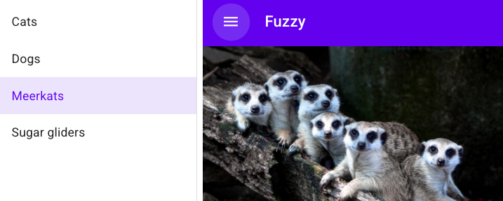

# Композиция компонент

Самый распространенный способ справиться со сложностью и разбить Lit-код на отдельные части — это _компонентная композиция_: то есть процесс создания большого сложного компонента из более мелких и простых. Представьте, что вам поручили реализовать экран пользовательского интерфейса:

.

Вероятно, вы можете определить области, реализация которых потребует определенных сложностей. Скорее всего, это могут быть компоненты.

Разделив сложность на определенные компоненты, вы значительно упрощаете работу, а затем можете соединить эти компоненты вместе, чтобы создать общий дизайн.

Например, довольно простой скриншот выше включает в себя несколько возможных компонентов: верхнюю панель, кнопку меню, ящик с пунктами меню для навигации по текущему разделу и область основного содержимого. Каждый из них может быть представлен компонентом. Сложный компонент, например ящик с меню навигации, можно разбить на множество мелких компонентов: сам ящик, кнопка для открытия и закрытия ящика, меню, отдельные пункты меню.

Lit позволяет создавать композиции, добавляя элементы в шаблон, будь то встроенные HTML-элементы или пользовательские элементы.

```js
render() {
  return html`
    <top-bar>
      <icon-button icon="menu" slot="nav-button"></icon-button>
      <span slot="title">Fuzzy</span>
    </top-bar>
    `;
}
```

## Что делает компонент хорошим

При принятии решения о том, как разделить функциональность, есть несколько моментов, которые помогают определить, когда следует создавать новый компонент. Часть пользовательского интерфейса может быть хорошим кандидатом на компонент, если применимо одно или несколько из следующих условий:

-   У него есть собственное состояние.
-   У него есть собственный шаблон.
-   Он используется более чем в одном месте, либо в этом компоненте, либо в нескольких компонентах.
-   Он сосредоточен на выполнении одной задачи.
-   У него есть хорошо определенный API.

Многократно используемые элементы управления, такие как кнопки, флажки и поля ввода, могут стать отличными компонентами. Но и более сложные элементы пользовательского интерфейса, такие как ящики и карусели, также являются отличными кандидатами на создание компонентов.

## Передача данных вверх и вниз по дереву

При обмене данными с подкомпонентами общее правило — следовать модели DOM: _свойства вниз_, _события вверх_.

-   Свойства вниз. Установка свойств в подкомпоненте обычно предпочтительнее, чем вызов методов в подкомпоненте. Задавать свойства легко в шаблонах Lit и других системах декларативных шаблонов.

-   События вверх. В веб-платформе по умолчанию элементы отправляют информацию вверх по дереву с помощью событий, часто в ответ на действия пользователя. Это позволяет хост-компоненту ответить на событие, преобразовать или повторно отправить событие для предков, расположенных дальше по дереву.

Несколько следствий из этой модели:

-   Компонент должен быть источником истины для подкомпонентов в его теневом DOM. Подкомпоненты не должны устанавливать свойства или вызывать методы своего основного компонента.

-   Если компонент изменяет публичное свойство у себя, он должен запустить событие, чтобы уведомить компоненты выше в дереве. Как правило, эти изменения происходят в результате действий пользователя — нажатия кнопки или выбора пункта меню. Вспомните родной элемент `input`, который запускает событие, когда пользователь меняет значение вводимого параметра.

Рассмотрим компонент меню, который содержит набор пунктов меню и раскрывает свойства `items` и `selectedItem` как часть своего публичного API. Его DOM-структура может выглядеть следующим образом:


Когда пользователь выбирает элемент, элемент `my-menu` должен обновить свое свойство `selectedItem`. Он также должен вызвать событие, чтобы уведомить любой компонент-владелец о том, что выбор изменился. Полная последовательность действий будет выглядеть следующим образом:

-   Пользователь взаимодействует с элементом, вызывая событие (либо стандартное событие типа `click`, либо событие, специфичное для компонента `my-item`).
-   Элемент `my-menu` получает это событие и обновляет свое свойство `selectedItem`. Он также может изменить некоторое состояние, чтобы выбранный элемент был выделен.
-   Элемент `my-menu` запускает семантическое событие, указывающее на то, что выбор изменился. Это событие может называться, например, `selected-item-changed`. Поскольку это событие является частью API для `my-menu`, оно должно быть семантически значимым в этом контексте.

Более подробную информацию о диспетчеризации и прослушивании событий можно найти в [Events](../components/events.md).

## Передача данных по дереву

Свойства вниз, а события вверх — хорошее правило для начала. Но что, если вам нужно обмениваться данными между двумя компонентами, не имеющими прямых отношений потомков? Например, двумя компонентами, которые являются братьями и сестрами в теневом дереве?

Одним из решений этой проблемы является использование паттерна _посредника_. В шаблоне посредника одноранговые компоненты не взаимодействуют друг с другом напрямую. Вместо этого взаимодействие осуществляется через третью сторону.

Простой способ реализовать паттерн посредника заключается в том, чтобы компонент-владелец обрабатывал события от своих дочерних компонентов и, в свою очередь, обновлял состояние своих дочерних компонентов, передавая измененные данные обратно вниз по дереву. Добавив посредника, вы можете передавать данные по дереву, используя знакомый принцип "события — вверх, свойства — вниз".

В следующем примере элемент-посредник прослушивает события от элементов `input` и `button` в своем теневом DOM. Он контролирует включенное состояние кнопки, чтобы пользователь мог нажать **Submit** только при наличии текста в поле ввода.

<litdev-example sandbox-base-url="https://playground.lit.dev/" style="--litdev-example-editor-lines-ts:38;
               --litdev-example-editor-lines-js:43;
               --litdev-example-preview-height:120px" project="v3-docs/composition/mediator-pattern" filename="mediator-element.ts"></litdev-example>

Другие паттерны посредников включают паттерны в стиле flux/Redux, в которых магазин посредничает в изменениях и обновляет компоненты через подписки. Если компоненты напрямую подписываются на изменения, это помогает избежать необходимости передавать все данные, необходимые дочерним компонентам, каждому родительскому компоненту.

## Легкие дочерние элементы DOM

В дополнение к узлам теневого DOM вы можете отображать дочерние узлы, предоставленные пользователем компонента, например, стандартный элемент `<select>` может принимать набор элементов `<option>` в качестве дочерних и отображать их как пункты меню.

Дочерние узлы иногда называют "светлым DOM", чтобы отличить их от теневого DOM компонента. For example:

```html
<top-bar>
    <icon-button
        icon="menu"
        slot="nav-button"
    ></icon-button>
    <span slot="title">Fuzzy</span>
</top-bar>
```

Здесь элемент `top-bar` имеет два легких DOM-дочерних элемента, предоставленных пользователем: кнопку навигации и заголовок.

Взаимодействие со светлыми дочерними элементами DOM отличается от взаимодействия с узлами в теневом DOM. Узлы в теневом DOM компонента управляются компонентом и не должны быть доступны извне компонента. Светлые дочерние элементы DOM управляются извне компонента, но доступ к ним также возможен. Пользователь компонента может добавлять или удалять легкие дочерние узлы DOM в любое время, поэтому компонент не может предполагать статичный набор дочерних узлов.

Компонент может контролировать, будут ли дочерние узлы отображаться и где, используя элемент `<slot>` в своем теневом DOM. Он также может получать уведомления о добавлении и удалении дочерних узлов, прослушивая событие `slotchange`.

Для получения дополнительной информации смотрите разделы [рендеринг дочерних элементов со слотами](../components/shadow-dom.md#slots) и [доступ к дочерним элементам со слотами](../components/shadow-dom.md#accessing-slotted-children).

Фотография суриката сделана [Anggit Rizkianto](https://unsplash.com/@anggit_mr) на [Unsplash](https://unsplash.com/photos/x3-OP_X0aH0).\_
